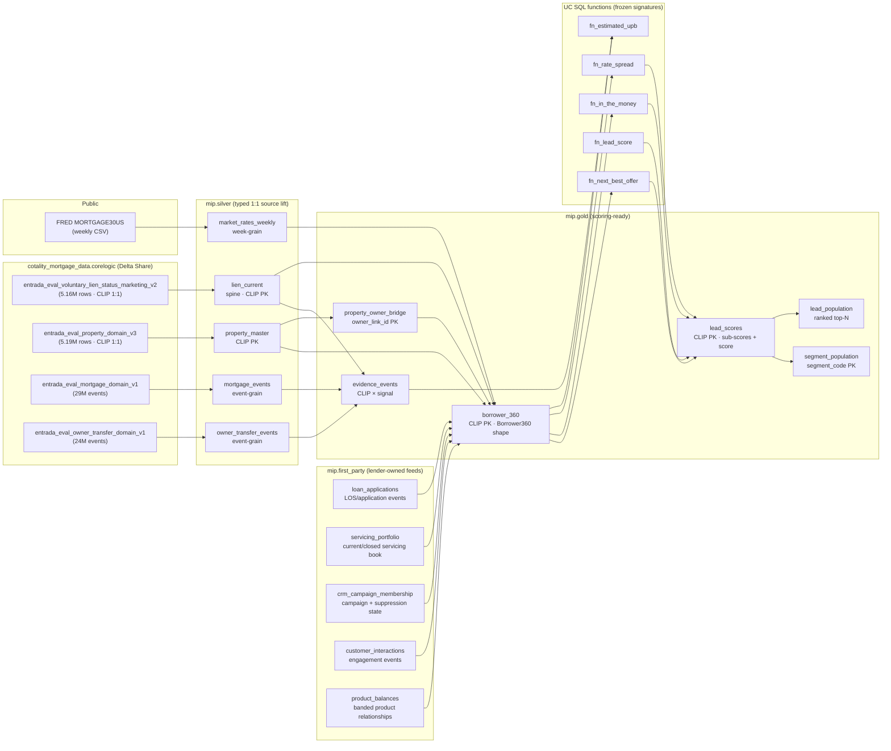

# Module 0 — Data Contract (Silver + Gold)

**Audience:** Internal implementation contract. Not approved for public release or external recording without Cotality review.

**Status:** Contract. Source for every silver/gold column targeted at the governed Cotality Delta Share plus the required public dataset (FRED `MORTGAGE30US`). The canonical SQL lives in `sql/ddl/`, `sql/transformations/`, `sql/uc_functions/`, and the deploy-rendered mirror under `sql/_rendered/`.

**Non-negotiables this contract inherits:**
- Scoring UDF signatures in `sql/uc_functions/` are frozen. Golden fixtures in `tests/fixtures/*.json` and `sql/fixtures/*_validation.sql` pin numeric behavior.
- Pydantic contracts in `backend/schemas/` are the API boundary. Gold columns must project cleanly into `Borrower360`, `LeadSummary`, `SegmentSummary`, `WhyPanel`, `EvidenceEvent`, `PortfolioPreview`, `OfferRecommendation`, `AuditEvent`.
- Geography scope is data-driven. Silver keeps all source rows with non-null
  state; county/ZIP coverage is discovered from `mip.gold.county_rollup` and
  `mip.gold.zip_rollup`; UI copy must disclose the discovered coverage rather
  than hardcoding demo-specific county counts.
- Demo lender: `Summit Mortgage`. Catalog: `mip`. Schemas: `silver`, `gold`.
- Synthetic borrower contact fields only: no outbound emails, phones, or names to the UI. Real names exist in the share; they do not leave gold without hashing. See §7 (PII Policy).

---

## 1. Lineage



---

## 1.1 First-Party Lender Feed Contracts

These tables represent the customer-owned side of the Apr 30 mortgage AI data
estate: LOS/application events, servicing book, CRM/campaign state,
engagement history, and product-balance relationships.

For the Summit Mortgage public demo, `sql/transformations/demo_first_party_feeds.sql`
can populate realistic synthetic rows from the evaluation-share borrower universe.
Those rows are real Delta rows and are consumed by the gold layer, but every
row carries `feed_mode='demo_synthetic'` and `synthetic_demo=true`. Customer
and production workspaces should set `MIP_ENABLE_DEMO_FIRST_PARTY_FEEDS=0`
before running `tools/render_sql.py` / deploy and before connecting real lender
feeds.

Shared first-party governance rules:

- No names, emails, phones, SSNs, account numbers, or street addresses.
- IDs are hashed (`*_id_hash`, `customer_key_hash`) or synthetic (`borrower_id`).
- `clip_ref` is display-safe and may be null until governed Cotality resolution.
- Source-readiness must disclose `synthetic_demo=true` as demo data, not real
  customer data.

| Table | Grain | Required safe fields |
|---|---|---|
| `mip.first_party.loan_applications` | Application event | `application_id_hash`, `customer_key_hash`, `borrower_id`, `state`, `zip`, status, channel, product intent, `application_at`, `source_system`, `feed_mode`, `synthetic_demo`, `refreshed_at` |
| `mip.first_party.servicing_portfolio` | Loan/account relationship | `servicing_loan_id_hash`, `customer_key_hash`, `borrower_id`, state/ZIP, product type, UPB/rate/delinquency/status metadata, `source_system`, `feed_mode`, `synthetic_demo`, `refreshed_at` |
| `mip.first_party.crm_campaign_membership` | Campaign membership | `campaign_member_id_hash`, `customer_key_hash`, `borrower_id`, campaign hash, channel, last touch, suppression reason, consent status, `source_system`, `feed_mode`, `synthetic_demo`, `refreshed_at` |
| `mip.first_party.customer_interactions` | Engagement event | `interaction_id_hash`, `customer_key_hash`, `borrower_id`, channel, type, outcome, `interaction_at`, `source_system`, `feed_mode`, `synthetic_demo`, `refreshed_at` |
| `mip.first_party.product_balances` | Product relationship | `product_balance_id_hash`, `customer_key_hash`, `borrower_id`, product family, balance band, tenure months, `source_system`, `feed_mode`, `synthetic_demo`, `refreshed_at` |

Gold consumption:

- Active servicing rows can mark `is_current_customer=true` and set the
  public-safe lender ref to the tenant alias.
- Closed servicing or funded application history can mark
  `is_former_customer=true` when there is no current tenant-serviced lien.
- Feed-category depth, recent positive interactions, and recent applications
  contribute to the relationship sub-score in both `borrower_360` and
  `lead_scores`.

## 2. Silver Layer

All silver tables: Delta, managed, cluster by `clip` (liquid clustering where CLIP is the join key, else by event date). Column types are explicit casts so schema drift in the share cannot leak into gold.

### 2.1 `mip.silver.lien_current` — the spine

- **Grain:** one row per `clip` (current-state snapshot).
- **Source:** `cotality_mortgage_data.corelogic.entrada_eval_voluntary_lien_status_marketing_v2` with non-null `situs_state`.
- **PK:** `clip` (enforced by UNIQUE test).
- **Clustering:** liquid cluster on `(situs_state, clip)`.
- **Refresh:** daily (share refreshes on Cotality's cadence; our pull is idempotent full-merge).

| Column | Type | Null | Source expression | Definition |
|---|---|---|---|---|
| `clip` | STRING | N | `clip` | Cotality mastered property ID. PK. |
| `situs_state` | STRING | N | `situs_state` | 2-char state code from refreshed source coverage. |
| `situs_zip_code` | STRING | Y | `SUBSTR(REGEXP_REPLACE(CAST(situs_zip_code AS STRING), '[^0-9]', ''), 1, 5)` | 5-digit ZIP (kept STRING to preserve leading zeros). |
| `owner_occupancy_code` | STRING | Y | `owner_occupancy_code` | `O` / `A` / `T` / NULL per CoreLogic dictionary. |
| `total_open_liens` | INT | Y | `CAST(total_number_of_open_mortgage_liens AS INT)` | Count of active mortgage liens. |
| `total_open_lien_balance` | BIGINT | Y | `CAST(total_amount_of_open_mortgage_liens AS BIGINT)` | Sum of open-lien balances, USD. |
| `avm_value` | BIGINT | Y | `CAST(estimated_value_mktg AS BIGINT)` | Current AVM (marketing). |
| `avm_value_high` | BIGINT | Y | `CAST(estimated_value_high_mktg AS BIGINT)` | AVM upper confidence bound. |
| `avm_value_low` | BIGINT | Y | `CAST(estimated_value_low_mktg AS BIGINT)` | AVM lower confidence bound. |
| `avm_confidence` | DOUBLE | Y | `CAST(confidence_score_mktg AS DOUBLE)` | 0..1 or 0..100 per CoreLogic; scale-check on ingest. |
| `avm_as_of_date` | DATE | Y | `TRY_TO_DATE(NULLIF(CAST(value_as_of_date_mktg AS STRING), '0'), 'yyyyMMdd')` | AVM vintage; Cotality ships this as `yyyyMMdd`, not ISO. |
| `estimated_equity` | BIGINT | Y | `CAST(estimated_equity AS BIGINT)` | AVM − lien balance (Cotality-computed). |
| `estimated_cltv` | DOUBLE | Y | `CAST(estimated_combined_ltv_loan_to_value AS DOUBLE)` | 0..100. |
| `purchase_amount` | BIGINT | Y | `CAST(purchase_amount AS BIGINT)` | Last purchase price. |
| `purchase_date` | DATE | Y | `TRY_TO_DATE(CAST(NULLIF(purchase_recording_date, 0) AS STRING), 'yyyyMMdd')` | Last deed recording date. |
| `purchase_cltv` | DOUBLE | Y | `CAST(purchase_combined_ltv_loan_to_value AS DOUBLE)` | Origination CLTV. |
| `first_pos_date` | DATE | Y | `TRY_TO_DATE(CAST(NULLIF(first_position_mortgage_date, 0) AS STRING), 'yyyyMMdd')` | 1st-lien origination. |
| `first_pos_amount` | BIGINT | Y | `CAST(first_position_mortgage_amount AS BIGINT)` | 1st-lien original amount. |
| `first_pos_rate` | DOUBLE | Y | `CASE WHEN first_position_mortgage_interest_rate IS NULL OR CAST(first_position_mortgage_interest_rate AS DOUBLE) <= 0 THEN NULL ELSE CAST(first_position_mortgage_interest_rate AS DOUBLE) / 100.0 END` | Fractional rate (0.0575 = 5.75%) — matches `fn_rate_spread` contract. Source is percent form. |
| `first_pos_rate_type` | STRING | Y | `first_position_mortgage_interest_rate_type_code` | `FIX` / `ARM` / NULL. |
| `first_pos_term_months` | INT | Y | `CAST(first_position_mortgage_term AS INT)` | Term in months. |
| `first_pos_loan_type` | STRING | Y | `first_position_mortgage_loan_type_code` | `CONV` / `FHA` / `VA` / etc. |
| `first_pos_purpose` | STRING | Y | `first_position_mortgage_purpose_code` | `PUR` / `REF` / etc. |
| `first_pos_ltv` | DOUBLE | Y | `CAST(first_position_mortgage_ltv_loan_to_value AS DOUBLE)` | 1st-lien LTV at origination. |
| `first_pos_lender_original` | STRING | Y | `first_position_lender_company_name` | Originating lender. |
| `first_pos_lender_current` | STRING | Y | `first_position_currently_assigned_lender_company_name` | Current servicer (59% coverage). |
| `second_pos_amount` | BIGINT | Y | `CAST(second_position_mortgage_amount AS BIGINT)` | 2nd-lien balance (0 / NULL if none). |
| `second_pos_rate` | DOUBLE | Y | `CASE WHEN second_position_mortgage_interest_rate IS NULL OR CAST(second_position_mortgage_interest_rate AS DOUBLE) <= 0 THEN NULL ELSE CAST(second_position_mortgage_interest_rate AS DOUBLE) / 100.0 END` | 2nd-lien fractional rate. Source is percent form. |
| `second_pos_purpose` | STRING | Y | `second_position_mortgage_purpose_code` | Detects HELOC / equity loan already in place. |
| `second_pos_lender` | STRING | Y | `second_position_lender_company_name` | 2nd-lien lender (competitor signal if != demo lender). |
| `ingest_ts` | TIMESTAMP | N | `CURRENT_TIMESTAMP()` | Audit timestamp. |
| `_meta_batch_id` | STRING | Y | `CAST(:batch_id AS STRING)` | Lakeflow run correlation id. |

**Coerce rules:** any numeric column with `?` / empty string in share → NULL. `first_pos_rate` and `second_pos_rate` are converted from Cotality percent form to fractional form and must be strictly `> 0` to be kept; rates ≤ 0 are coerced to NULL (defends `fn_rate_spread` against unit confusion). Raw owner name and situs street columns do not land in `silver.lien_current`; owner hashing is centralized in `silver.property_master`.

### 2.2 `mip.silver.property_master`

- **Grain:** one row per `clip`.
- **Source:** `entrada_eval_property_domain_v3` with non-null `situs_state`.
- **PK:** `clip`.
- **Clustering:** liquid on `(situs_state, situs_cbsa_code, clip)`.
- **Refresh:** daily.

| Column | Type | Null | Source expression | Definition |
|---|---|---|---|---|
| `clip` | STRING | N | `clip` | PK, joins 1:1 to `lien_current`. |
| `fips_county_code` | STRING | Y | `fips_county_code` | 5-char FIPS. |
| `situs_state` | STRING | N | `situs_state` | 2-char state code from refreshed source coverage. |
| `situs_city` | STRING | Y | `situs_city` | City. |
| `situs_zip_code` | STRING | Y | `SUBSTR(REGEXP_REPLACE(CAST(situs_zip_code AS STRING), '[^0-9]', ''), 1, 5)` | 5-digit ZIP. |
| `situs_cbsa_code` | STRING | Y | `situs_core_based_statistical_area_cbsa` | Metro (CBSA) code. |
| `situs_lat` | DOUBLE | Y | `CAST(block_level_latitude AS DOUBLE)` | Block-level latitude (not parcel-level). |
| `situs_lon` | DOUBLE | Y | `CAST(block_level_longitude AS DOUBLE)` | Block-level longitude. |
| `owner_link_id` | STRING | Y | `owner_1_identifier` | Cotality Owner Link. 83% coverage. |
| `owner_name_hash` | STRING | Y | `sha2(LOWER(TRIM(COALESCE(owner_1_full_name, ''))) || ':' || salt, 256)` | Salted owner-name hash. Raw name is read, hashed, and dropped at ingest. |
| `owner_is_corporate` | BOOLEAN | Y | `UPPER(TRIM(COALESCE(CAST(owner_1_corporate_indicator AS STRING), ''))) = 'Y'` | Corporate owner flag. |
| `owner_occupancy_code` | STRING | Y | `owner_occupancy_code` | Owner-occupancy code. |
| `mailing_city` | STRING | Y | `mailing_city` | |
| `mailing_state` | STRING | Y | `mailing_state` | |
| `is_absentee` | BOOLEAN | Y | `mailing_state IS NOT NULL AND UPPER(TRIM(mailing_state)) <> UPPER(TRIM(situs_state))` | Investor/second-home signal. |
| `foreclosure_stage_code` | STRING | Y | `foreclosure_stage_code` | Current distress stage. |
| `last_foreclosure_date` | DATE | Y | `TRY_TO_DATE(CAST(NULLIF(last_foreclosure_transaction_date, 0) AS STRING), 'yyyyMMdd')` | Most recent FC event. |
| `year_built` | INT | Y | `CAST(year_built AS INT)` | Property year built. |
| `living_area_sqft` | INT | Y | `CAST(total_living_area_square_feet_all_bldgs AS INT)` | Living area. |
| `bedrooms` | INT | Y | `CAST(total_number_of_bedrooms_all_bldgs AS INT)` | |
| `bathrooms` | DOUBLE | Y | `CAST(total_number_of_bathrooms AS DOUBLE)` | |
| `calculated_total_value` | BIGINT | Y | `CAST(calculated_total_value AS BIGINT)` | County market value. |
| `assessed_total_value` | BIGINT | Y | `CAST(assessed_total_value AS BIGINT)` | Assessor value. |
| `total_tax_amount` | DOUBLE | Y | `CAST(total_tax_amount AS DOUBLE)` | Property tax. |
| `tax_year` | INT | Y | `CAST(tax_year AS INT)` | |
| `ingest_ts` | TIMESTAMP | N | `CURRENT_TIMESTAMP()` | |
| `_meta_batch_id` | STRING | Y | `CAST(:batch_id AS STRING)` | Lakeflow run correlation id. |

### 2.3 `mip.silver.mortgage_events`

- **Grain:** one row per historical mortgage event (origination, refi, HELOC, release).
- **Source:** `entrada_eval_mortgage_domain_v1` with non-null `deed_situs_state_static`.
- **PK:** `mortgage_composite_transaction_id` (composite txn id in share).
- **Clustering:** liquid on `(clip, mortgage_derived_date)`.
- **Refresh:** daily.

| Column | Type | Null | Source expression | Definition |
|---|---|---|---|---|
| `mortgage_txn_id` | STRING | N | `mortgage_composite_transaction_id` | PK. |
| `clip` | STRING | N | `clip` | FK → `silver.lien_current`/`property_master`. |
| `situs_state` | STRING | N | `deed_situs_state_static` | 2-char state code from refreshed source coverage. |
| `event_date` | DATE | Y | `TRY_TO_DATE(CAST(NULLIF(mortgage_derived_date, 0) AS STRING), 'yyyyMMdd')` | Event date. |
| `event_year` | INT | Y | `YEAR(event_date)` | Convenience column; used for cohort aggregates. |
| `mortgage_amount` | BIGINT | Y | `CAST(mortgage_amount AS BIGINT)` | Loan amount. |
| `rate_cascade` | DOUBLE | Y | `CAST(mortgage_interest_rate_cascade AS DOUBLE)` | Fractional rate from cascade. |
| `purpose_code` | STRING | Y | `mortgage_purpose_code` | |
| `loan_type_code` | STRING | Y | `mortgage_loan_type_code` | |
| `is_refinance` | BOOLEAN | Y | `CAST(COALESCE(refinance_loan_indicator, 0) AS BOOLEAN)` | Source indicator is 1/0. |
| `is_equity_loan` | BOOLEAN | Y | `CAST(COALESCE(equity_loan_indicator, 0) AS BOOLEAN)` | HELOC/HEL flag; source indicator is 1/0. |
| `is_reverse_mortgage` | BOOLEAN | Y | `CAST(COALESCE(reverse_mortgage_indicator, 0) AS BOOLEAN)` | Source indicator is 1/0. |
| `lender_name` | STRING | Y | `lender_company_name` | Lender at event time. |
| `release_date` | DATE | Y | `TRY_TO_DATE(CAST(NULLIF(mortgage_release_date, 0) AS STRING), 'yyyyMMdd')` | Lien release date if any. |
| `status_indicator` | STRING | Y | `mortgage_status_indicator` | |
| `borrower_identifier` | STRING | Y | `borrower_1_identifier` | Borrower/entity id (not Owner Link). |
| `ingest_ts` | TIMESTAMP | N | `CURRENT_TIMESTAMP()` | |
| `_meta_batch_id` | STRING | Y | `CAST(:batch_id AS STRING)` | Lakeflow run correlation id. |

### 2.4 `mip.silver.owner_transfer_events`

- **Grain:** one row per historical deed/sale event.
- **Source:** `entrada_eval_owner_transfer_domain_v1` with non-null `deed_situs_state_static`.
- **PK:** composite txn id in share → `transfer_txn_id`.
- **Clustering:** liquid on `(clip, sale_derived_date)`.
- **Refresh:** daily.

| Column | Type | Null | Source expression | Definition |
|---|---|---|---|---|
| `transfer_txn_id` | STRING | N | `owner_transfer_composite_transaction_id` | PK. |
| `clip` | STRING | N | `clip` | FK. |
| `situs_state` | STRING | N | `deed_situs_state_static` | 2-char state code from refreshed source coverage. |
| `sale_date` | DATE | Y | `TRY_TO_DATE(CAST(NULLIF(sale_derived_date, 0) AS STRING), 'yyyyMMdd')` | |
| `sale_amount` | BIGINT | Y | `CAST(sale_amount AS BIGINT)` | |
| `sale_type_code` | STRING | Y | `sale_type_code` | |
| `is_cash_purchase` | BOOLEAN | Y | `CAST(COALESCE(cash_purchase_indicator, 0) AS BOOLEAN)` | Source indicator is 1/0. |
| `is_investor_purchase` | BOOLEAN | Y | `CAST(COALESCE(investor_purchase_indicator, 0) AS BOOLEAN)` | Source indicator is 1/0. |
| `is_reo` | BOOLEAN | Y | `CAST(COALESCE(foreclosure_reo_indicator, 0) AS BOOLEAN)` | Source indicator is 1/0. |
| `is_short_sale` | BOOLEAN | Y | `CAST(COALESCE(short_sale_indicator, 0) AS BOOLEAN)` | Source indicator is 1/0. |
| `is_new_construction` | BOOLEAN | Y | `CAST(COALESCE(new_construction_indicator, 0) AS BOOLEAN)` | Source indicator is 1/0. |
| `is_resale` | BOOLEAN | Y | `CAST(COALESCE(resale_indicator, 0) AS BOOLEAN)` | Source indicator is 1/0. |
| `is_interfamily` | BOOLEAN | Y | `CAST(COALESCE(interfamily_related_indicator, 0) AS BOOLEAN)` | Source indicator is 1/0. |
| `buyer_is_corporate` | BOOLEAN | Y | `CAST(COALESCE(buyer_1_corporate_indicator, 0) AS BOOLEAN)` | Source indicator is 1/0. |
| `buyer_identifier` | STRING | Y | `buyer_1_identifier` | |
| `buyer_mailing_state` | STRING | Y | `buyer_mailing_state` | |
| `ingest_ts` | TIMESTAMP | N | `CURRENT_TIMESTAMP()` | |
| `_meta_batch_id` | STRING | Y | `CAST(:batch_id AS STRING)` | Lakeflow run correlation id. |

### 2.5 `mip.silver.market_rates_weekly`

- **Grain:** one row per (series, observation week).
- **Source:** FRED API, series `MORTGAGE30US` (30-year) and `MORTGAGE15US` (optional, 15-year). Ingested via a small Databricks workflow (weekly job writes CSV → table).
- **PK:** `(series_id, observation_week)`.
- **Clustering:** partitioned by `series_id`, clustered by `observation_week`.
- **Refresh:** weekly (FRED publishes Thursdays; job runs Friday 07:00 UTC).

| Column | Type | Null | Source expression | Definition |
|---|---|---|---|---|
| `series_id` | STRING | N | FRED series code | `MORTGAGE30US` / `MORTGAGE15US`. |
| `observation_week` | DATE | N | FRED `date` | Week-starting Monday. |
| `rate_pct` | DOUBLE | N | FRED `value` | Rate in percent (6.40 == 6.40%). Ingest rejects NULL. |
| `rate_fraction` | DOUBLE | N | `rate_pct / 100.0` | Fractional rate (matches `fn_rate_spread` contract). |
| `vintage_ts` | TIMESTAMP | N | FRED pull time | Audit timestamp. |
| `is_latest` | BOOLEAN | N | window fn: `row_number() over (partition by series_id order by observation_week desc) = 1` | Convenience flag for the gold join. |

**Public-dataset note:** FRED is free for redistribution; no license blocker. Any metric view that consumes the current rate MUST join on `is_latest = TRUE` to keep `fn_rate_spread` deterministic across a demo session.

### 2.6 `mip.silver.property_owners` (S1.1 multi-owner + trust/LLC)

- **Grain:** one row per `(clip, owner_position)` — one row per occupied owner slot (`owner_1..owner_4` column families in `entrada_eval_property_domain_v3`), max 4 owners per property record. Duplicate Owner Links inside one CLIP collapse to the lowest slot, so rows with a non-null `owner_link_id` equivalently satisfy one row per `(clip, owner_link)`.
- **Source:** `entrada_eval_property_domain_v3` with non-null `clip` + `situs_state` (same per-CLIP dedup tiebreak as §2.2).
- **PK:** `(clip, owner_position)`.
- **Clustering:** liquid on `(clip)`.
- **Refresh:** daily via the Lakeflow feature pipeline (`silver_property_owners` @dlt.table); warehouse-MERGE twin in `sql/transformations/silver_property_owners.sql`.
- **Compatibility view:** `mip.silver.property_owners_primary` projects the `owner_position = 1` row per CLIP with the legacy single-owner column vocabulary (`owner_is_corporate`), so existing single-owner consumers (which read `silver.property_master`) keep working unchanged and new consumers get a drop-in primary-owner surface. Created by the `init_property_owners_primary_view` sql_task in `mip_refresh_silver`.

> **Scope note — ROADMAP-TEMPORARY.** `owner_entity_type` is a **name/indicator classifier**, not entity resolution. The current slice is deliberately *classify + caveat + suppress* only: classify each owner slot from the owner name string, the Y/N corporate indicator, the slot-1 original trust name, and Owner Link presence; caveat multi-owner / trust / LLC / unresolved ownership in the UI; and suppress unresolved owners from every contact-eligible population (§3.2 `marketing_eligible`). **Cotality entity resolution is work-in-progress upstream** — when mastered entity types ship, this classifier is replaced, the `unresolved` bucket shrinks to true resolution failures, and suppressed populations re-open. This scope is a temporary roadmap state, not a permanent product ceiling.

Classifier contract (branch order is normative; shared verbatim by `backend/services/owner_classification.py`, `sql/transformations/silver_property_owners.sql`, and `pipelines/lakeflow/mip_feature_pipeline.py`; pinned by `tests/fixtures/owner_entity_type_golden.json`):

| # | Condition (evaluated in order) | `owner_entity_type` | `resolution_confidence` |
|---|---|---|---|
| 1 | vacant slot (no name, no trust name, no Owner Link) | *(no row)* | — |
| 2 | `owner_1_original_trust_name` populated (slot 1) | `trust` | 0.95 |
| 3 | name matches trust regex (`TRUST/TRUSTEE(S)/TRST/REVOCABLE/IRREVOCABLE/trailing TR`) | `trust` | 0.9 |
| 4 | name matches LLC/entity regex AND corporate indicator `Y` | `llc` | 0.95 |
| 5 | name matches LLC/entity regex | `llc` | 0.85 |
| 6 | corporate indicator `Y`, no entity pattern in name | `llc` | 0.6 |
| 7 | name + Owner Link present | `individual` | 0.9 |
| 8 | name present, Owner Link missing | `unresolved` | 0.4 |
| 9 | Owner Link present, name blank | `unresolved` | 0.5 |

| Column | Type | Null | Source expression | Definition |
|---|---|---|---|---|
| `clip` | STRING | N | `clip` | PK part 1. |
| `owner_position` | INT | N | slot ordinal 1..4 | PK part 2. |
| `owner_link_id` | STRING | Y | `owner_N_identifier` | Cotality Owner Link; NULL ⇒ slot classifies `unresolved`. |
| `owner_name_hash` | STRING | Y | `sha2(LOWER(TRIM(owner_N_full_name)) \|\| ':' \|\| salt, 256)` | Same salt contract as §2.2; NULL when the slot has no name. Raw names never land. |
| `owner_entity_type` | STRING | N | classifier above | `individual` / `trust` / `llc` / `unresolved`. |
| `resolution_confidence` | DOUBLE | N | classifier above | Deterministic 0..1 literal per branch. |
| `is_corporate_indicator` | BOOLEAN | N | `UPPER(TRIM(owner_N_corporate_indicator)) = 'Y'` | Same Y/N coercion as §2.2. |
| `is_contact_eligible` | BOOLEAN | N | `owner_entity_type <> 'unresolved'` | Unresolved owners are excluded from contact-eligible populations. |
| `situs_state` | STRING | N | `situs_state` | Coverage inherited from refreshed source rows. |
| `ingest_ts` | TIMESTAMP | N | `CURRENT_TIMESTAMP()` | |
| `_meta_batch_id` | STRING | Y | `CAST(:batch_id AS STRING)` | Lakeflow run correlation id. |

**Contact-eligibility contract:** `gold.borrower_360` (§3.2) aggregates this table per CLIP into `owner_count`, `has_unresolved_owner`, and `primary_owner_entity_type`. When `has_unresolved_owner` (any unresolved slot, or **no owner rows at all** — fail closed), `marketing_eligible` is forced FALSE and `suppression_reason` is stamped `unresolved_owner` unless a first-party CRM suppression already applies. Every contact-eligible query in the product gates on `marketing_eligible = TRUE`, so the exclusion is global.

---

## 3. Gold Layer

All gold tables: Delta, managed, partition/cluster tuned for the Module 0 queries (score-desc top-N and segment aggregates). NOT exposed to the UI raw — served via `backend/services/databricks_sql.py` which projects to the Pydantic schemas.

### 3.1 `mip.gold.property_owner_bridge`

- **Grain:** one row per `owner_link_id`.
- **Source:** `silver.property_master` aggregated.
- **PK:** `owner_link_id`.
- **Clustering:** `owner_link_id`.
- **Refresh:** daily, downstream of `property_master`.

| Column | Type | Null | Source expression | Definition |
|---|---|---|---|---|
| `owner_link_id` | STRING | N | `property_master.owner_link_id` | PK; Cotality Owner Link. |
| `related_property_count` | INT | N | `COUNT(DISTINCT clip)` per owner | Drives `Borrower360.related_property_count` and investor branch. |
| `corporate_property_count` | INT | N | `SUM(CASE WHEN owner_is_corporate THEN 1 ELSE 0 END)` | |
| `absentee_property_count` | INT | N | `SUM(CASE WHEN is_absentee THEN 1 ELSE 0 END)` | |
| `distinct_states_count` | INT | N | `COUNT(DISTINCT situs_state)` | Multi-market investor signal. |
| `distinct_cbsa_count` | INT | N | `COUNT(DISTINCT situs_cbsa_code)` | |
| `primary_clip` | STRING | Y | `MAX(clip) FILTER (owner_occupancy_code='O')` | Primary residence CLIP; NULL if no owner-occupant. |
| `refreshed_at` | TIMESTAMP | N | latest `mip.ref.refresh_run_state.refresh_at` | |

### 3.2 `mip.gold.borrower_360`

- **Grain:** one row per `clip`.
- **Source:** `silver.lien_current` (spine) ⟕ `silver.property_master` ⟕ `gold.property_owner_bridge` ⟕ `silver.market_rates_weekly(is_latest)`.
- **PK:** `clip`.
- **Clustering:** liquid on `(situs_state, clip)`; Z-order on `opportunity_score` after first demo refresh.
- **Refresh:** daily full rebuild (5.16M rows ≈ minutes on a serverless warehouse; precomputed gold is the production-read posture, not recompute-on-read).
- **Pydantic target:** `backend.schemas.lead.Borrower360` (super-set of `LeadSummary`).

| Column | Type | Null | Source expression | Pydantic field | Definition |
|---|---|---|---|---|---|
| `clip` | STRING | N | `lien_current.clip` | `clip_id` | PK. Mapped `clip` → `clip_id` at router. |
| `borrower_id` | STRING | N | `CONCAT('B-', LPAD(UPPER(CONV(CAST(ABS(XXHASH64(clip)) AS STRING), 10, 36)), 13, '0'))` | `borrower_id` | Synthetic stable id derived from CLIP. Deterministic; no PII; base36 width avoids the old 5-digit collision class. |
| `display_name` | STRING | N | `'Owner ' \|\| SUBSTR(owner_name_hash, 1, 8)` | `display_name` | **Synthesized label** — real names never reach the UI. See §7. |
| `city` | STRING | Y | `property_master.situs_city` | `city` | |
| `state` | STRING | N | `lien_current.situs_state` | `state` | |
| `zip` | STRING | Y | `lien_current.situs_zip_code` | `zip` | 5-digit string. |
| `situs_cbsa_code` | STRING | Y | `property_master.situs_cbsa_code` | — | Gold-only; used for geography drill-down. |
| `county_fips_5` | STRING | Y | `property_master.fips_county_code` | — | Gold-only; used for county/ZIP rollups. |
| `segment_codes` | ARRAY<STRING> | N | derived: see §4 | `segment_codes` | Ordered list of `SegmentCode` Literals. |
| `equity_estimate` | BIGINT | N | `GREATEST(0, COALESCE(avm_value, 0) - estimated_current_lien_balance)` where `estimated_current_lien_balance = fn_estimated_upb(first_pos_amount, first_pos_rate, months_elapsed) + COALESCE(second_pos_amount, 0)` when first-lien inputs are present | `equity_estimate` | USD integer; gold-derived estimated equity for gap A5. |
| `equity_pct` | INT | N | `CASE WHEN avm_value > 0 THEN GREATEST(0, LEAST(100, 100 - GREATEST(0, ROUND(100.0 * COALESCE(estimated_current_lien_balance, 0) / avm_value)))) WHEN estimated_cltv > 0 THEN GREATEST(0, LEAST(100, 100 - GREATEST(0, ROUND(estimated_cltv)))) ELSE 0 END` | — | Feeds `fn_in_the_money` / `fn_next_best_offer`; uses the same estimated lien balance as `current_lien_balance`. |
| `rate_spread_bps` | INT | N | `mip.gold.fn_rate_spread(first_pos_rate, market_rates_weekly.rate_fraction)` | `rate_spread_bps` | UDF output; rates are fractional on both sides. |
| `market_rate_fraction` | DOUBLE | N | `market_rates_weekly.rate_fraction` (where `is_latest`) | `why_panel.market_rate` | |
| `opportunity_score` | INT | N | `mip.gold.fn_lead_score(economic_incentive, intent_trigger, fit, relationship, evidence)` | `opportunity_score` | Computed in `borrower_360`; `lead_scores` is the parallel scoring audit surface. |
| `confidence` | INT | N | `CAST(ROUND((economic_incentive + intent_trigger + fit + relationship + evidence) / 5.0) AS INT)` | `confidence` | Average of 5 sub-scores, 0..100. Keeps Python parity with `mock_data._build_borrower`. |
| `recommended_offer_code` | STRING | N | `mip.gold.fn_next_best_offer(...)` | — | Lowercase code. |
| `recommended_offer` | STRING | N | in-SQL label map from `recommended_offer_code` | `recommended_offer` | Human label; mirrors `NBO_PRODUCT_LABELS`. |
| `why_now` | STRING | N | derived template (see §6) | `why_now` | One sentence. Template, no PII. |
| `evidence_ids` | ARRAY<STRING> | N | top-3 `gold.evidence_events` ordered by `signal_rank, evidence_id` | `evidence_ids` | Ordered; UI pulls full events from `gold.evidence_events`. |
| `approval_status` | STRING | N | `'pending'` default (actual state lives in Lakebase) | `approval_status` | Gold carries default; Lakebase authoritative. |
| `owner_link_id` | STRING | Y | `property_master.owner_link_id` | `owner_link_id` | API emits `owner_link_ref_*` by default; raw Owner Link remains below the redaction boundary. |
| `subject_property` | STRING | N | `CONCAT('Synthetic property · ', situs_city, ', ', situs_state, ' ', situs_zip_code)` | `subject_property` | **No raw street address.** |
| `avm_value` | BIGINT | N | `COALESCE(lien_current.avm_value, 0)` | `avm_value` | 0 when AVM coverage gap. |
| `current_lien_balance` | BIGINT | N | `fn_estimated_upb(first_pos_amount, first_pos_rate, months_elapsed) + COALESCE(second_pos_amount, 0)` when first-lien inputs are present; otherwise `COALESCE(lien_current.total_open_lien_balance, 0)` | `current_lien_balance` | Caveated as estimated UPB in Borrower 360. |
| `current_rate` | DOUBLE | N | `COALESCE(first_pos_rate * 100, 0.0)` | `current_rate` | **Percent form** (5.75, not 0.0575) — matches Pydantic `current_rate: float` and `mock_data` convention. |
| `ltv` | INT | N | `GREATEST(0, CASE WHEN avm_value > 0 THEN ROUND(100.0 * COALESCE(estimated_current_lien_balance, 0) / avm_value) WHEN estimated_cltv > 0 THEN ROUND(estimated_cltv) ELSE 0 END)` | `ltv` | Display LTV is not upper-capped; underwater borrowers may exceed 100 while `equity_pct` remains capped for scoring. |
| `related_property_count` | INT | N | `COALESCE(property_owner_bridge.related_property_count, 1)` | `related_property_count` | |
| `owner_count` | INT | N | `COALESCE(owner_rollup.owner_count, 0)` | `owner_count` | S1.1: occupied owner slots per §2.6 (max 4). Multi-owner caveat chip. |
| `has_unresolved_owner` | BOOLEAN | N | `COALESCE(owner_rollup.has_unresolved_owner, TRUE)` | `has_unresolved_owner` | S1.1: fail closed — any unresolved slot, or no owner rows at all. Forces `marketing_eligible = FALSE` + `suppression_reason = 'unresolved_owner'`. ROADMAP-TEMPORARY per §2.6. |
| `primary_owner_entity_type` | STRING | Y | slot-1 `owner_entity_type` | `primary_owner_entity_type` | S1.1: `individual` / `trust` / `llc` / `unresolved`; NULL when no owner rows. |
| `is_owner_occupied` | BOOLEAN | N | `owner_occupancy_code = 'O'` | — | Feeds `fit`. |
| `is_absentee` | BOOLEAN | N | `property_master.is_absentee` | — | Feeds investor branch. |
| `is_corporate_owner` | BOOLEAN | N | `property_master.owner_is_corporate` | — | Feeds investor branch. |
| `has_permit` | BOOLEAN | N | `FALSE` (**BLOCKED — true filed permits not in share**) | — | See §9. |
| `listed_for_sale` | BOOLEAN | N | `silver.listing_activity.is_active_listing` | — | Live Cotality MLS/Listings overlay. TRUE when a current active/under-contract listing row resolves to the borrower CLIP. |
| `is_investor` | BOOLEAN | N | `related_property_count >= 2 OR is_corporate_owner OR is_absentee` | — | Derived; feeds `fn_next_best_offer`. |
| `is_current_customer` | BOOLEAN | N | `lender_dictionary tenant match OR first_party.servicing_portfolio active row` | — | Current relationship to the configured tenant lender. The governed lender dictionary and optional first-party servicing feed are the source of truth; no brand-token substring fallback is allowed. |
| `is_former_customer` | BOOLEAN | N | `(historical_tenant_distinct_clips > 0 OR closed first-party servicing OR funded first-party application) AND NOT is_current_customer` | — | Historical tenant-financed/serviced relationship with no current tenant-serviced lien. Distinct from competitor-lien. |
| `is_competitor_lien` | BOOLEAN | N | `first_pos_lender_current IS NOT NULL AND NOT is_current_customer` | — | Current servicer known and not the tenant; used as a recapture/competitor signal. |
| `has_first_party_relationship` | BOOLEAN | N | any resolved LOS, servicing, CRM, interaction, or product-balance row | — | Tells proof/readiness that customer-owned data contributed to relationship scoring. |
| `first_party_relationship_depth` | INT | N | bounded count of first-party feed categories resolved for the borrower | — | Relationship sub-score input. |
| `first_party_recent_interactions` | INT | N | recent positive first-party engagement count | — | Relationship sub-score input. |
| `first_party_recent_application` | BOOLEAN | N | recent LOS/application event exists | — | Relationship sub-score input. |
| `first_party_synthetic_demo` | BOOLEAN | N | any contributing first-party row has `synthetic_demo=true` | — | Disclosure flag; must not be treated as real customer data. |
| `second_pos_amount` | BIGINT | Y | `lien_current.second_pos_amount` | `second_pos_amount` | 2nd-lien balance. `NULL` and `0` both mean no active second-position balance for the equity segment predicate. |
| `first_pos_loan_type` | STRING | Y | `lien_current.first_pos_loan_type` | — | Feeds `fit`. |
| `loan_product_type` | STRING | Y | `mip.gold.fn_loan_product_type(first_pos_loan_type, first_pos_amount, conforming_loan_limit_applied)` | `loan_product_type` | Controlled vocab `conventional` / `jumbo` / `fha` / `va` / `other`; NULL when the source loan type code is missing (unknown never guesses). Drives the PRODUCT TYPE filter and SegmentCard facets. |
| `origination_channel` | STRING | Y | `MAX_BY(LOWER(TRIM(application_channel)), application_at)` over funded `first_party.loan_applications` rows with a non-blank channel (`NULLIF(TRIM(..), '') IS NOT NULL`) | `origination_channel` | LOS channel of the most recent funded first-party application (`loan_officer` / `digital` / `branch` / `call_center` in the demo feed); NULL when no funded application resolves or the channel is blank/whitespace — rendered "Unknown", never invented. |
| `owner_name_hash` | STRING | N | `property_master.owner_name_hash` | — | See §7. |
| `min_spread_bps_applied` | INT | N | `mip.ref.offer_rules_config['mip_min_spread_bps']`, fallback `75` | — | Threshold provenance for WhyPanel and offer proof. |
| `min_equity_pct_applied` | INT | N | `mip.ref.offer_rules_config['mip_min_equity_pct']`, fallback `15` | — | Threshold provenance for WhyPanel and offer proof. |
| `heloc_equity_min_applied` | INT | N | `mip.ref.offer_rules_config['mip_heloc_equity_min_pct']`, fallback `35` | — | Threshold provenance for `fn_next_best_offer` and the equity segment. |
| `cashout_equity_min_applied` | INT | N | `mip.ref.offer_rules_config['mip_cashout_equity_min_pct']`, fallback `25` | — | Threshold provenance for `fn_next_best_offer`. |
| `retention_min_spread_applied` | INT | N | `mip.ref.offer_rules_config['mip_retention_min_spread_bps']`, fallback `50` | — | Threshold provenance for `fn_next_best_offer` and the retention segment. |
| `conforming_loan_limit_applied` | BIGINT | N | `mip.ref.offer_rules_config['mip_conforming_loan_limit_usd']`, fallback `806500` | — | Conforming loan limit applied this refresh when classifying `jumbo` via `fn_loan_product_type`. |
| `in_the_money` | BOOLEAN | N | `mip.gold.fn_in_the_money(rate_spread_bps, equity_pct, min_spread_bps_applied, min_equity_pct_applied)` | — | Materialized ITM flag. |
| `trigger_timeline_json` | STRING | N | JSON-encoded top-3 `gold.evidence_events` rows | `trigger_timeline` | Pre-materialized to avoid per-row fan-out at read; service decodes to `list[EvidenceEvent]`. |
| `refreshed_at` | TIMESTAMP | N | latest `mip.ref.refresh_run_state.refresh_at` | — | Shared timestamp captured once per refresh run. |

**Schema-drift note:** gold still keys by raw `clip`, but Pydantic `Borrower360.clip_id` receives `clip_ref_*` from `backend.services.pii_redaction.mask_cotality_id`. Router mapping is `row.clip -> masked clip_id`, not raw CLIP display.

### 3.3 `mip.gold.lead_scores`

- **Grain:** one row per `clip`.
- **Source:** `gold.borrower_360` + per-CLIP aggregates of `silver.mortgage_events` (last 90d event counts for `intent_trigger`).
- **PK:** `clip`.
- **Clustering:** Z-order on `opportunity_score DESC`.
- **Refresh:** daily, downstream of `borrower_360`.

| Column | Type | Null | Source | Definition |
|---|---|---|---|---|
| `clip` | STRING | N | `borrower_360.clip` | PK. |
| `economic_incentive` | INT | N | continuous blend of `rate_spread_bps` + `equity_pct` (see §5) | 0..100. |
| `intent_trigger` | INT | N | recent-event counts + competitor/investor/rate/equity/current-customer mix (see §5) | 0..100. |
| `fit` | INT | N | owner-occupancy + loan-type + geography fit (see §5) | 0..100. |
| `relationship` | INT | N | current-customer / former-customer / competitor-lien / investor relationship ladder plus owner-level Summit distinct-CLIP count (see §5) | 0..100. |
| `evidence` | INT | N | `10 * evidence_event_count + second_pos_amount tail term` (see §5) | 0..100. |
| `opportunity_score` | INT | N | `mip.gold.fn_lead_score(economic_incentive, intent_trigger, fit, relationship, evidence)` | 0..100. **Frozen UDF.** |
| `confidence` | INT | N | `CAST(ROUND((economic_incentive + intent_trigger + fit + relationship + evidence) / 5.0) AS INT)` | 0..100. Mirrors `_build_borrower`. |
| `in_the_money` | BOOLEAN | N | `mip.gold.fn_in_the_money(rate_spread_bps, equity_pct, min_spread_bps_applied, min_equity_pct_applied)` | Demo thresholds are the default; applied values are materialized. |
| `recommended_offer_code` | STRING | N | `mip.gold.fn_next_best_offer(...)` | |
| `has_first_party_relationship` | BOOLEAN | N | `borrower_360.has_first_party_relationship` | TRUE when optional first-party feeds resolve to this borrower. |
| `first_party_relationship_depth` | INT | N | `borrower_360.first_party_relationship_depth` | Bounded count of contributing first-party feed categories. |
| `first_party_recent_interactions` | INT | N | `borrower_360.first_party_recent_interactions` | Recent positive interaction count from the first-party engagement feed. |
| `first_party_recent_application` | BOOLEAN | N | `borrower_360.first_party_recent_application` | TRUE when recent first-party LOS/application activity exists. |
| `first_party_synthetic_demo` | BOOLEAN | N | `borrower_360.first_party_synthetic_demo` | Disclosure flag for Summit demo rows; must not be described as real lender data. |
| `min_spread_bps_applied` | INT | N | from `borrower_360.min_spread_bps_applied` | Carried so `WhyPanel.min_spread_bps` reflects the run. |
| `min_equity_pct_applied` | INT | N | from `borrower_360.min_equity_pct_applied` | |
| `heloc_equity_min_applied` | INT | N | from `borrower_360.heloc_equity_min_applied` | |
| `cashout_equity_min_applied` | INT | N | from `borrower_360.cashout_equity_min_applied` | |
| `retention_min_spread_applied` | INT | N | from `borrower_360.retention_min_spread_applied` | |
| `refreshed_at` | TIMESTAMP | N | latest `mip.ref.refresh_run_state.refresh_at` | |

### 3.4 `mip.gold.evidence_events`

- **Grain:** one row per (`clip`, `evidence_id`) — each row IS an `EvidenceEvent`.
- **Source:** unioned from `silver.lien_current` (rate_spread, equity, loan_type_fit, competitor_lien), `silver.market_rates_weekly` (market_trend), `silver.mortgage_events` (last refi/payoff), `silver.owner_transfer_events` (last sale), `gold.property_owner_bridge` (multi-property), `silver.listing_activity` (MLS listing), `silver.heloc_propensity` (HELOC propensity), and `silver.refi_propensity` (refi propensity), plus explainability-only `product_type` (from `silver.lien_current` via `fn_loan_product_type`) and `origination_channel` (from `first_party.loan_applications` funded rows). True filed-permit signal types await a Cotality Building Permits feed; no `permit` evidence rows are emitted.
- **PK:** `(clip, evidence_id)`.
- **Clustering:** liquid on `clip`; timeline ordering is by `signal_rank` / timestamp in the query layer.
- **Refresh:** daily.
- **Pydantic target:** `backend.schemas.common.EvidenceEvent`.

| Column | Type | Null | Source | Pydantic field | Definition |
|---|---|---|---|---|---|
| `clip` | STRING | N | source tables | — | Not in `EvidenceEvent` but required for join / filter. |
| `evidence_id` | STRING | N | `CONCAT('ev-', SUBSTR(sha2(CONCAT(clip, '\|', signal_type, '\|', timestamp), 256), 1, 12))` | `evidence_id` | Stable across refreshes — decoupled from row order so `Borrower360.evidence_ids` lists stay stable. |
| `source_product` | STRING | N | literal per source (`'Voluntary Lien'`, `'AVM'`, `'Owner Link'`, `'Property'`, `'Mortgage Domain'`, `'Owner Transfer'`, `'Market Rates'`, `'MLS Listings'`, `'HELOC Propensity'`, `'Refi Propensity'`, `'First-Party LOS'`) | `source_product` | |
| `source_table` | STRING | N | literal UC path (e.g. `'mip.silver.lien_current'`) | `source_table` | **Must be a real UC path** — the EvidenceDrawer shows it. |
| `signal_type` | STRING | N | controlled vocab includes live `listing`, live `heloc_propensity`, live `refi_propensity`, and reserved `permit` alongside `rate_spread`, `equity`, `loan_type_fit`, `product_type`, `origination_channel`, `competitor_lien`, `multi_property`, `absentee_mailing`, `corporate_owner`, `foreclosure_stage`, `recent_refi`, `recent_payoff`, `recent_sale`, and `market_trend` | `signal_type` | `loan_type_fit` is compliance-visible rationale for the symmetric CONV/FHA/VA fit branch and is excluded from the evidence sub-score. `product_type` and `origination_channel` are explainability-only rows for the S1.6 dimensions and are likewise excluded from the evidence sub-score. `listing`, `heloc_propensity`, and `refi_propensity` are live; `permit` is reserved for true filed-permit data and remains un-emitted. |
| `signal_value` | STRING | N | string-cast of the computed value (`'+88 bps'`, `'$285K'`, `'3 properties'`, `'competitor refi'`) | `signal_value` | Human-readable and deterministic. |
| `display_text` | STRING | N | one-sentence template per `signal_type` | `display_text` | Deterministic; no PII. |
| `confidence` | DOUBLE | N | per-signal: AVM `confidence_score_mktg`; rate_spread and market_trend `0.92`; Owner-Link derived `0.85`; recent events and competitor/foreclosure signals `0.89`. | `confidence` | 0..1 per `EvidenceEvent` constraint. |
| `timestamp` | STRING | N | ISO-8601 string of the source event, observation, as-of, or refreshed date (`event_date`, `release_date`, `sale_date`, `observation_week`, `avm_as_of_date`, `refreshed_at`). | `timestamp` | Kept STRING to match Pydantic (it declares `str`, not datetime). |
| `signal_rank` | INT | N | deterministic: priority of signal type for ordering `Borrower360.evidence_ids` | — | Gold-only. |

### 3.5 `mip.gold.lead_population`

- **Grain:** one row per `clip`, filtered to `opportunity_score >= 50` for the Lead Queue. Other CLIPs live in `borrower_360` but do not surface in the hot queue.
- **Source:** `gold.borrower_360` WHERE `opportunity_score >= 50` ORDER BY `opportunity_score DESC`.
- **PK:** `clip`.
- **Clustering:** `opportunity_score DESC`.
- **Refresh:** daily, downstream of `borrower_360`.

Columns = exact superset of what `LeadSummary` needs, plus `rank_overall` and `rank_within_state`. No new PII surfaces here.

| Column | Type | Null | Source | Definition |
|---|---|---|---|---|
| (inherits all `LeadSummary` fields from `borrower_360`, including `loan_product_type`, `origination_channel`, and the `conforming_loan_limit_applied` provenance column) | — | — | — | Served directly via `SELECT *` projection. |
| `rank_overall` | INT | N | `DENSE_RANK() OVER (ORDER BY opportunity_score DESC, clip)` | |
| `rank_within_state` | INT | N | `DENSE_RANK() OVER (PARTITION BY state ORDER BY opportunity_score DESC, clip)` | |
| `population_version` | STRING | N | `CONCAT(DATE_FORMAT(refreshed_at, 'yyyyMMdd'), '-v1')` | Used in the EvidenceDrawer footer as a provenance chip. |

### 3.6 `mip.gold.segment_population`

- **Grain:** one row per `(segment_code, state)` **plus** one row per `segment_code` with `state = '_ALL'`.
- **Source:** `gold.borrower_360` aggregated; segment membership computed per §4.
- **PK:** `(segment_code, state)`.
- **Clustering:** `segment_code`.
- **Refresh:** daily.
- **Pydantic target:** `backend.schemas.lead.SegmentSummary` (served with `state='_ALL'` rows).

| Column | Type | Null | Source | Pydantic field | Definition |
|---|---|---|---|---|---|
| `segment_code` | STRING | N | enum (see §4) | `code` | Must match `SegmentCode` Literal. |
| `state` | STRING | N | `situs_state` (or `_ALL`) | — | Gold-only; service filter. |
| `name` | STRING | N | static map | `name` | |
| `count` | INT | N | `COUNT(*)` | `count` | |
| `delta_vs_prior` | STRING | N | `'+' \|\| CAST(ROUND(100 * (count - prior_count) / GREATEST(prior_count, 1)) AS STRING) \|\| '%'` | `delta` | QoQ. Needs a prior-period snapshot table (daily partition-rollup). |
| `avg_score` | INT | N | `CAST(ROUND(AVG(opportunity_score)) AS INT)` | `avg_score` | |
| `description` | STRING | N | static map | `description` | |
| `color` | STRING | N | static map | `color` | Hex. |
| `loan_product_mix` | ARRAY<STRUCT<value STRING, count INT>> | N | `COUNT(*)` per `COALESCE(loan_product_type, 'unknown')` within the cell, sorted count desc then value | `loan_product_mix` | SegmentCard facet mix; facet counts sum to the segment count (NULL rolls up as `unknown`). |
| `origination_channel_mix` | ARRAY<STRUCT<value STRING, count INT>> | N | `COUNT(*)` per `COALESCE(origination_channel, 'unknown')` within the cell, sorted count desc then value | `origination_channel_mix` | SegmentCard facet mix; `unknown` aggregates borrowers with no funded first-party application. |
| `refreshed_at` | TIMESTAMP | N | latest `mip.ref.refresh_run_state.refresh_at` | — | |

### 3.7 `mip.gold.household_rollup`

- **Grain:** one row per `borrower_360.borrower_id` / CLIP.
- **Source:** `gold.borrower_360`, S1.1 `silver.property_owners`, and `silver.property_master`.
- **PK:** `borrower_id`.
- **Clustering:** `(household_id, borrower_id)`.
- **Refresh:** daily, downstream of `borrower_360`; read only when campaign household dedup is explicitly enabled.
- **Default unit:** BORROWER remains the default everywhere. Household is opt-in at campaign creation only.

Deterministic derivation order:

1. **Owner Link:** group CLIPs through shared `silver.property_owners.owner_link_id` rows, including co-owner links on CLIPs reached through one shared Owner-Link hop. The canonical key is the lexicographically smallest reachable Owner Link and is hashed before landing.
2. **Mailing-address heuristic:** if no Owner Link exists, group by salted `owner_name_hash` plus normalized `mailing_city` / `mailing_state`. `mailing_street_address` never lands in silver or gold, so this heuristic is intentionally conservative.
3. **Singleton:** if neither signal exists, the borrower is its own household.

Primary-contact ranking is deterministic: contact-eligible members (`marketing_eligible=true` and `has_unresolved_owner=false`) rank before ineligible members, then `opportunity_score DESC`, then `borrower_id ASC`. A campaign can suppress co-owners only after this rank is computed; an ineligible member is never promoted to primary.

| Column | Type | Null | Source | Definition |
|---|---|---|---|---|
| `clip` | STRING | N | `borrower_360.clip` | Below API redaction boundary. |
| `borrower_id` | STRING | N | `borrower_360.borrower_id` | Synthetic `B-[0-9A-Z]{13}` id. |
| `household_id` | STRING | N | `HH-` + sha2 suffix over the derivation key | Public household id. |
| `household_derivation_method` | STRING | N | derivation branch | `owner_link`, `mailing_address`, or `singleton`. |
| `household_derivation_key_hash` | STRING | N | sha2 over non-PII key | Audit reconciliation only; raw Owner Links and mailing city/state are not emitted. |
| `derivation_source_tables` | ARRAY<STRING> | N | literal UC paths | EvidenceDrawer lineage for surfaced household counts. |
| `household_member_count` | INT | N | window count | Members assigned to the household id. |
| `eligible_member_count` | INT | N | window count | Members eligible to be a campaign contact. |
| `household_rank` | INT | N | window rank | Eligible-first primary rank. |
| `is_household_primary` | BOOLEAN | N | rank + eligibility | TRUE only for the eligible rank-1 member. |
| `primary_borrower_id` | STRING | Y | rank result | Synthetic borrower id for the selected primary contact. |
| `suppressed_by_household_dedup` | BOOLEAN | N | rank + eligibility | TRUE for eligible co-owners suppressed by opt-in household dedup. |
| `owner_link_reachable_count` | INT | N | `silver.property_owners` | Count of reachable Owner Links used by the owner-link branch. |
| `refreshed_at` | TIMESTAMP | N | `mip.ref.refresh_run_state.refresh_at` | Shared gold refresh timestamp. |

---

## 4. Segment Membership (SQL definitions)

Segment codes match `Literal["itm", "listed", "permit", "investor", "equity", "retention"]` exactly. A borrower belongs to a segment if the predicate is TRUE — non-exclusive. The legacy `permit` code is retained for API/backward-compatibility, but the borrower-facing label is **HELOC Intent**.

| `segment_code` | Predicate (SQL, evaluated on `gold.borrower_360`) | Shippable now? |
|---|---|---|
| `itm` | `in_the_money = TRUE` where `in_the_money` uses `min_spread_bps_applied` and `min_equity_pct_applied` | Yes |
| `equity` | `equity_pct >= heloc_equity_min_applied AND COALESCE(second_pos_amount, 0) = 0` (clean 1st-lien, HELOC-grade equity) | Yes |
| `investor` | `related_property_count >= 2 OR is_corporate_owner OR is_absentee` | Yes |
| `retention` | `is_current_customer = TRUE AND (rate_spread_bps >= retention_min_spread_applied OR is_competitor_lien OR listed_for_sale)` | Yes |
| `listed` | `listed_for_sale = TRUE` from live `mip.silver.listing_activity` rows | Yes |
| `permit` | `has_permit = TRUE OR has_heloc_propensity_trigger = TRUE` | **HELOC Intent** is live from Cotality HELOC propensity; true filed Building Permits remain pending and do not set `has_permit` (§9). |

Under the current share, `listed` materializes from live MLS rows in `mip.silver.listing_activity`. The legacy `permit` segment code is now the UI-compatible **HELOC Intent** segment backed by Cotality HELOC propensity rows; true filed building-permit predicates remain false until a permit feed lands. `gold.segment_population` still emits canonical segment rows so live HELOC intent is visible while unavailable permit dependencies are disclosed instead of silently inferred.

Current-customer and competitor-lien flags are CLIP-grain current-servicer signals resolved through `mip.ref.lender_dictionary`. `is_former_customer` is an owner-level historical tenant-lender relationship with no current tenant-serviced lien; it powers Portfolio Builder's "Former customer" filter and the relationship score, but the contracted `retention` segment remains current-customer retention until a lender-approved recapture segment is added.

---

## 5. Sub-score Definitions (continuous, for `gold.borrower_360` and `gold.lead_scores`)

Each returns an integer in [0, 100]. The CTAS formulas are continuous rather than tiered so the queue does not collapse into a few repeated score values. `gold.borrower_360` and `gold.lead_scores` must compute the same score and confidence for every borrower; live `test_gold_data_truth.py` treats drift between those tables as a release-blocking data-truth failure.

**economic_incentive** (weight 0.35):
```
CAST(LEAST(100, GREATEST(0,
    LEAST(55, CAST(ROUND(3 * sqrt(GREATEST(0, rate_spread_bps))) AS INT))
  + LEAST(50, CAST(ROUND(0.5 * LEAST(100, GREATEST(0, equity_pct))) AS INT))
)) AS INT)
```

**intent_trigger** (weight 0.30): deterministic current-state signal mix from competitor lien, related-property count, rate-spread, equity, current-customer flags, live MLS listing activity, and Cotality HELOC/refi propensity scores. Filed building-permit inputs remain hard-false until the corresponding Cotality share arrives.
```
LEAST(100, GREATEST(0,
    20 * CAST(is_competitor_lien AS INT)
  + LEAST(25, GREATEST(0, (COALESCE(related_property_count, 1) - 1) * 10))
  + LEAST(30, CAST(ROUND(2 * sqrt(GREATEST(0, rate_spread_bps))) AS INT))
  + LEAST(10, GREATEST(0, CAST(equity_pct / 10 AS INT)))
  + 8 * CAST(is_current_customer AS INT)
  + 18 * CAST(listed_for_sale AS INT)
  + LEAST(18, CAST(ROUND(heloc_propensity_score / 50.0) AS INT))
  + LEAST(12, CAST(ROUND(refi_propensity_score / 85.0) AS INT))
)
```

**fit** (weight 0.15):
```
LEAST(100, GREATEST(0,
    CASE
      WHEN is_owner_occupied AND first_pos_loan_type IN ('CONV','FHA','VA') THEN 70
      WHEN is_owner_occupied                                                THEN 60
      WHEN is_corporate_owner                                               THEN 50
      ELSE 40
    END
  + LEAST(20, 4 * COALESCE(bedrooms, 0))
  + LEAST(10, 3 * CAST(COALESCE(bathrooms, 0) AS INT))
))
```

`gold.lead_scores` joins the same property/owner fields needed for fit parity with `borrower_360`; it is an audit surface, not an approximate scoring shortcut.

**relationship** (weight 0.10):
```
-- historical_tenant_distinct_clips := COUNT(DISTINCT me.clip)
-- per owner_link_id across mip.silver.mortgage_events where the lender
-- resolves to a non-competitor row in mip.ref.lender_dictionary. Counts
-- *distinct properties previously financed by the tenant lender* for this
-- owner, not lien events (slice13-accuracy fix: prior impl counted events,
-- inflating the score for owners with multiple events on the same CLIP).
LEAST(100, GREATEST(0,
  CASE
    WHEN is_current_customer THEN 70
    WHEN is_former_customer  THEN 60
    WHEN is_competitor_lien  THEN 55
    WHEN related_property_count > 1 THEN 45
    ELSE 35
  END
  + CASE
      WHEN is_current_customer OR is_former_customer
        THEN LEAST(25, 5 * LEAST(5, historical_tenant_distinct_clips))
      ELSE LEAST(25, GREATEST(0, (COALESCE(related_property_count, 1) - 1) * 5))
    END
))
```

`gold.lead_scores` applies the same current-customer / former-customer /
competitor / investor ladder, adds an owner-level
`historical_tenant_distinct_clips` bonus for current and former customers, and
adds bounded first-party relationship depth, recent positive interactions, and
recent application activity. The historical count is distinct CLIPs per
`owner_link_id`, not repeat mortgage events on one property, and the tenant
lender comes from `mip.ref.lender_dictionary`.

Closed-loop outcome ingestion uses a public-safe competitor vocabulary:
`competitor_lender_label` accepts only `Competitor A` through `Competitor Z`
or `Competitor Other`. Raw lender brands, tenant lender names, and person names
are intentionally rejected at the API, audit, and Lakebase constraint layers.
Operators who need real competitor intelligence should keep the alias-to-lender
mapping in the governed `mip.ref.lender_dictionary` deployment configuration
or an internal CRM system; Module 0 surfaces only the alias in API responses,
Genie answers, and audit metadata.

**evidence** (weight 0.10): direct count of scoring evidence rows in `gold.evidence_events` plus a bounded second-lien evidence tail. `permit` rows are excluded because true filed permits remain a pending feed, and `loan_type_fit` is explainability-only. Live `listing`, `heloc_propensity`, and `refi_propensity` evidence rows contribute to the count.
```
LEAST(100, GREATEST(0,
  10 * evidence_event_count
  + CASE
      WHEN second_pos_amount IS NOT NULL AND second_pos_amount > 0
        THEN LEAST(20, CAST(ROUND(sqrt(second_pos_amount / 1000.0)) AS INT))
      ELSE 0
    END
))
```

### 5.1 Fair-Lending Posture For Scoring Inputs

No protected-class attribute is an input to the Module 0 scoring primitives or
sub-scores. The scoring surface does not consume race, color, religion,
national origin, sex, marital status, age, receipt of public assistance,
consumer-protection exercise, FICO, or credit-bureau tradeline data.

CONV/FHA/VA parity is a contract: owner-occupied `CONV`, `FHA`, and `VA`
first-position loan types receive identical fit treatment (`70` before
property-size additions). Future changes must not rank those three loan types
asymmetrically without a signed lender fair-lending review. The
`loan_type_fit` evidence row exists so a compliance reviewer can see when this
symmetric branch contributed to the dossier rationale; it is excluded from the
evidence sub-score so explainability does not retune scores.

The `is_current_customer` relationship boost is a retention/recapture signal,
not a protected-class feature. The customer compliance team should explicitly
review it for each deploying lender because historical customer books can
reflect prior market access and underwriting patterns. Customer compliance
sign-off should explicitly bless the `is_current_customer THEN 70`
relationship branch before production use.

---

## 6. `why_now` Template (per `recommended_offer_code`)

Deterministic, no PII. Populated at gold to avoid per-request string work.

| `recommended_offer_code` | Template |
|---|---|
| `refi_plus_heloc` | `The current mortgage appears meaningfully above today's market reference rate, and the property has enough equity to review refinance and home-equity options together.` |
| `heloc` | `Home-equity signals suggest a conversation about available equity may be useful without replacing the first mortgage.` |
| `refi` | `The current mortgage appears above today's market reference rate, and the property has enough equity to review refinance options.` |
| `cash_out` | `The borrower appears to have available equity, so a licensed loan officer can review whether a cash-out refinance would fit their goals.` |
| `purchase` | `The property is listed for sale, so the useful conversation is likely about financing the next home before closing.` |
| `investor` | `Owner Link ties {related_property_count} related properties, so route the review to an investor-lending specialist.` |
| `retention` | `This current-customer relationship has signals worth reviewing, so prioritize a service-focused check-in before the borrower shops alternatives.` |
| `nurture` | `No strong borrower benefit is active yet, so keep this borrower in nurture until a clearer signal appears.` |

---

## 7. PII Policy at the Gold Boundary

CLAUDE.md forbids real PII in the UI. Real names and addresses exist in the share. Therefore: **no raw PII column crosses silver → gold.**

Rules:
1. **Names** (`owner_1_full_name`, `buyer_1_full_name`): raw owner names are read only in the silver transformation, hashed into `owner_name_hash`, and dropped before persistence. Buyer names are not landed.
   - Algorithm: `sha2(LOWER(TRIM(name)) || ':' || salt, 256)`.
   - Salt: Databricks secret scope `mip`, key `pii-salt-v1`, provisioned by `scripts/deploy.sh` step 4d (create-if-missing). There is **no fallback literal** (removed 2026-06-11, audit P1-4: a source-committed salt made hashing predictable whenever the secret was missing — silently); a missing secret fails the silver refresh visibly. The salt is **never rotated**: rotation changes every `owner_name_hash` (and the display labels derived from it) across refreshes, breaking hash join/compare stability between gold snapshots. (`borrower_id` itself is salt-independent — `xxhash64(clip)` base-36 — so the narrative-seed IDs survive, but every hash-derived surface would shift.)
   - `Borrower360.display_name` is a **synthesized label**, not derived from the hash beyond visual variety: `'Owner ' || SUBSTR(owner_name_hash, 1, 8)`. This avoids any chance of reversing short-hash collisions to a plausible name.
2. **Addresses** (`situs_street_address`, `mailing_street_address`): never propagated past silver. `Borrower360.subject_property` is a city/state/ZIP synthetic string. Lat/lon stays at **block level** (already the share's granularity — parcel coordinates are not available, which is a feature for this demo).
3. **Last-4 address digit**: NOT emitted. If a future demo iteration wants "Owner on Elm St.", that requires a separate review — not this contract.
4. **ZIP**: kept at 5 digits; no ZIP+4. 5-digit ZIPs on a high-equity borrower can be re-identifying — the mitigation is that `display_name` is synthetic and `opportunity_score` plus ZIP alone is not reverse-lookupable to a household.
5. **Silver raw PII columns** (`owner_full_name_raw`, `situs_street_address_raw`, `buyer_full_name_raw`, `mailing_street_raw`): not declared in silver DDL. Unit DDL contract tests reject these names in silver/gold table bodies, so a future attempt to persist them fails in CI before deployment.
6. **Audit**: every gold refresh writes a row to `mip_app.audit` (Lakebase) with the list of columns projected, so a PII leak is detectable after the fact even if the UC policy is misconfigured.
7. **Log/snapshot hygiene**: `frontend/src/mocks/demoData.ts` already uses synthetic names. The real-data path projects the synthesized label; demo screenshots never include raw names.

---

## 8. Golden-fixture Strategy for Real-data Integration

The scoring UDF golden fixtures (`tests/fixtures/*.json`, `sql/fixtures/*_validation.sql`) are **input-space** fixtures — they pin the function contract, not specific CLIPs. They do not need to change.

What we need is a **real-data integration fixture**: canonical CLIPs picked from the share that exercise the unblocked `purchase`, `refi_plus_heloc`, `refi`, `cash_out`, `investor`, `retention`, and `nurture` branches of `fn_next_best_offer`. The filed-permit branch remains an input-space fixture case until Building Permits land; HELOC Intent is currently backed by Cotality HELOC propensity plus equity thresholds.

### Selection procedure (run once, check fixtures into repo)

1. Query the share for three CLIPs matching the target branches:
   - `CLIP_REFI_PLUS_HELOC`: `first_pos_rate >= 0.0625 AND estimated_cltv <= 55 AND equity_pct >= 40 AND foreclosure_stage_code IS NULL AND owner_occupancy_code = 'O' AND situs_state = <chosen demo state>`
   - `CLIP_CASH_OUT`: high equity with rate spread below the refi floor, no active second-position lien.
   - `CLIP_RETENTION`: current Summit-serviced loan with `rate_spread_bps >= 50`.
   - `CLIP_PURCHASE`: live MLS-listed borrower whose winning branch is purchase.
2. For each chosen CLIP, snapshot the input tuple to `tests/fixtures/real_clip_integration.json`:
   ```json
   {
     "snapshot_version": "20260421-v1",
     "market_rate_fraction": 0.0688,
     "market_rate_series": "MORTGAGE30US",
     "market_rate_observation_week": "2026-04-13",
     "cases": [
       { "fixture_id": "real_refi_plus_heloc",
         "clip": "<pinned CLIP>",
         "inputs": {"current_rate": 0.0650, "equity_pct": 46, "has_permit": false, "listed_for_sale": false, ...},
         "expected_offer": "refi_plus_heloc",
         "expected_in_the_money": true
       }
     ]
   }
   ```
3. Pin by **input tuple**, not by CLIP row lookup. The integration test reads the pinned inputs and feeds them into the UDF — it does not re-query the share. This decouples the test from the share refresh cadence: even if the Cotality snapshot drifts and the real CLIP's current rate changes, the fixture keeps passing (it is testing the UDF against the pinned inputs). A second, soft test verifies the CLIP *still exists* in the share; on failure it warns but does not break CI, and we rotate the fixture.
4. Salt CLIPs for logs: `log_id = xxhash64(clip)` so we can reproduce selection without leaking the actual CLIP into non-secure logs.

This gives us the same contract stability as the input-space fixtures, with a "the real data still tells this story" sanity check on top.

---

## 9. Blocked Columns

| Column | Blocked by | Gold behavior until unblocked |
|---|---|---|
| `borrower_360.has_permit` | Cotality **Building Permits** product not yet licensed (P0 request per gap analysis §8). | Hardcoded `FALSE`; no filed-permit evidence emits. The legacy `permit` segment code now represents borrower-facing HELOC Intent when `has_heloc_propensity_trigger=TRUE`; filed permits remain separate and pending. |
| `evidence_events` rows of `signal_type='permit'` | Permits blocker. | Never emitted on the real-data path until the Cotality Permits share lands. |
| Pre-foreclosure leading indicators (NOD/NTS) | Cotality **Pre-Foreclosure** product (P2 ask, not a walkthrough blocker). | Fall back to `property_master.foreclosure_stage_code` snapshot. Adequate per gap analysis §2 segment 7. |
| 15-year offer lane (`fn_next_best_offer` refinement) | Public `MORTGAGE15US` ingestion not yet wired (optional per gap analysis §5). | Single 30-year market rate is good enough for Module 0. |

MLS Listings are no longer blocked: `borrower_360.listed_for_sale` materializes from `mip.silver.listing_activity`, `evidence_events.signal_type='listing'` emits display-safe listing evidence, and the `purchase` branch can fire on real data. Filed Building Permits remain the explicit blocked source.

---

## 10. Recommended Demo Metro

**Recommendation: Cook County, IL (Chicago CBSA `16980`). Lender book-of-business: Summit Mortgage–IL.**

**Why:** Cook County, IL is the strongest current validation-workspace county
for telling both Module 0 stories on one screen. It has the largest property
count currently discovered in the share (1.86M), the largest open-lien
population (1.13M), and the **highest average 1st-position rate (4.75%)**
among the current discovered geographies — which seats a large pool visibly
above any plausible market rate. Combined with mid-range average CLTV (49.2%),
Chicago simultaneously supports the "refi-now" talk-track and the "cash-out /
HELOC at high-rate market" talk-track. Cook County also gives us a clear
geography drill-down (city → CBSA → ZIP) while staying inside the coverage
reported by the app.

**Runner-up:** Douglas County, CO (Denver–Aurora CBSA `19740`). Stronger equity distribution (avg CLTV 54.1%) makes the HELOC story crisp, but the 160K-property discovered county is small enough that the Segment Intelligence counts look thin next to a broad "marketable book" KPI.

---

## 11. Refresh Cadence Summary

| Table | Cadence | Trigger |
|---|---|---|
| `silver.lien_current`, `silver.property_master`, `silver.mortgage_events`, `silver.owner_transfer_events` | Daily | Lakeflow pipeline `mip.silver_refresh` (kicked after the Delta Share refresh notification). |
| `silver.market_rates_weekly` | Weekly (Fri 07:00 UTC) | Databricks Workflow `mip.market_rates_ingest`. |
| `gold.property_owner_bridge` | Daily | Workflow `mip.gold_refresh`, step 1. |
| `gold.evidence_events` | Daily | Step 2, after `gold.property_owner_bridge` so evidence carries governed owner/property context. |
| `gold.borrower_360` | Daily | Step 3, after `gold.evidence_events`. |
| `gold.lead_scores` | Daily | Step 4, after `gold.borrower_360`. |
| `gold.lead_population` | Daily | Step 5. |
| `gold.segment_population` | Daily + prior-day snapshot for `delta` | Step 6. |

Walkthrough posture: all gold is precomputed. The backend never triggers a refresh. The app runs on live Unity Catalog — there is no mock-mode runtime fallback (see [CLAUDE.md](../CLAUDE.md) "Negative prompting"). Flakiness is handled by the resilience layer (retry, warm-start, SWR cache, circuit breaker, degraded-state banner).

---

## 12. Pydantic ↔ Gold Contract Drift Check

Verified against `backend/schemas/lead.py`, `common.py`, `why.py`, `portfolio.py`, `offer.py`, `audit.py`:

| Pydantic field | Gold source | Status |
|---|---|---|
| `LeadSummary.borrower_id` | `borrower_360.borrower_id` (synthetic, derived from CLIP) | OK. |
| `LeadSummary.display_name` | `borrower_360.display_name` (synthesized label) | OK. No real PII. |
| `LeadSummary.segment_codes` | `borrower_360.segment_codes` | OK — values constrained to `Literal["itm","listed","permit","investor","equity","retention"]`. |
| `LeadSummary.rate_spread_bps` / `opportunity_score` / `confidence` | `borrower_360` carried through `lead_population` | OK. `lead_scores` is the parallel scoring audit surface. |
| `Borrower360.clip_id` | `borrower_360.clip` | **Mask + rename at boundary** (`clip` → `clip_ref_*` in `clip_id`). Raw CLIP is not an API/UI/audit display field by default. |
| `Borrower360.current_rate` | `borrower_360.current_rate` (percent form) | OK — Pydantic is `float`, gold is `DOUBLE`. |
| `Borrower360.trigger_timeline` / `evidence_events` | `gold.evidence_events` rows (no `clip` field projected) | OK — service layer drops `clip` and `signal_rank` before returning. |
| `WhyPanel.market_rate` | `borrower_360.market_rate_fraction` | OK — fractional form. |
| `WhyPanel.sources` | `gold.lead_scores` contributes one entry per UDF touched; gold can carry a static `sources` array | OK. |
| `SegmentSummary` | `gold.segment_population` rows with `state='_ALL'` | OK. |
| `PortfolioPreview` | aggregation over `gold.borrower_360` filtered by `PortfolioCriteria` — implemented in service layer | OK. |
| `OfferRecommendation` | `gold.lead_scores.recommended_offer_code` + `NBO_PRODUCT_LABELS` + `why_now` | OK — service layer resolves the label. |
| `AuditEvent` | Lakebase `mip_app.audit` (NOT gold) | OK — gold is read-only for the UI path; mutations live in Lakebase. |

**No breaking drift.** Two naming adjustments happen at the service layer (not in gold DDL):
- `gold.borrower_360.clip` → masked `Borrower360.clip_id` (`clip_ref_*`).
- `gold.segment_population.delta_vs_prior` → `SegmentSummary.delta`.

Both are pure renames, not schema changes.
