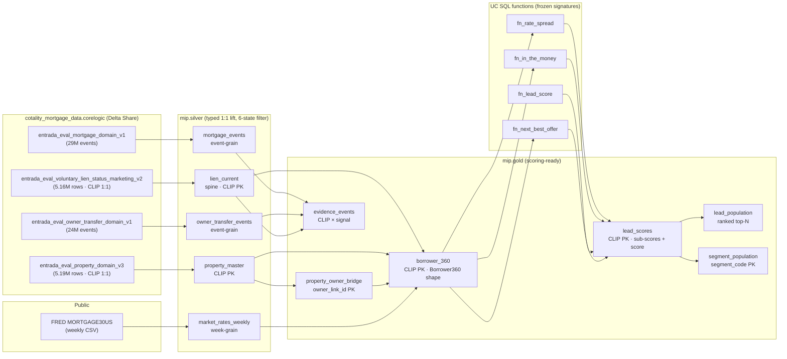

# Module 0 — Data Contract (Silver + Gold)

**Status:** Contract. Source for every silver/gold column targeted at the Cotality Delta Share (`cotality_mortgage_data.corelogic`) plus the one required public dataset (FRED `MORTGAGE30US`). Backfills the 1-line placeholder SQL in `sql/transformations/`.

**Non-negotiables this contract inherits:**
- Scoring UDF signatures in `sql/uc_functions/` are frozen. Golden fixtures in `tests/fixtures/*.json` and `sql/fixtures/*_validation.sql` pin numeric behavior.
- Pydantic contracts in `backend/schemas/` are the API boundary. Gold columns must project cleanly into `Borrower360`, `LeadSummary`, `SegmentSummary`, `WhyPanel`, `EvidenceEvent`, `PortfolioPreview`, `OfferRecommendation`, `AuditEvent`.
- 6-state footprint (IL/CA/FL/TX/WA/CO) is the only legal geography; `situs_state` / `deed_situs_state_static` filter applied at silver.
- Demo lender: `Summit Mortgage`. Catalog: `mip`. Schemas: `silver`, `gold`.
- Synthetic borrower contact fields only: no outbound emails, phones, or names to the UI. Real names exist in the share; they do not leave gold without hashing. See §7 (PII Policy).

---

## 1. Lineage



---

## 2. Silver Layer

All silver tables: Delta, managed, cluster by `clip` (liquid clustering where CLIP is the join key, else by event date). Column types are explicit casts so schema drift in the share cannot leak into gold.

### 2.1 `mip.silver.lien_current` — the spine

- **Grain:** one row per `clip` (current-state snapshot).
- **Source:** `cotality_mortgage_data.corelogic.entrada_eval_voluntary_lien_status_marketing_v2` filtered to `situs_state IN ('IL','CA','FL','TX','WA','CO')`.
- **PK:** `clip` (enforced by UNIQUE test).
- **Clustering:** liquid cluster on `(situs_state, clip)`.
- **Refresh:** daily (share refreshes on Cotality's cadence; our pull is idempotent full-merge).

| Column | Type | Null | Source expression | Definition |
|---|---|---|---|---|
| `clip` | STRING | N | `clip` | Cotality mastered property ID. PK. |
| `situs_state` | STRING | N | `situs_state` | 2-char state code; filter guarantees 6-state set. |
| `situs_zip_code` | STRING | Y | `situs_zip_code` | 5-digit ZIP (kept STRING to preserve leading zeros). |
| `situs_cbsa_code` | STRING | Y | (joined from property_master) | Populated in gold; see §3.1. Held here as `NULL` placeholder or carried via view. |
| `owner_occupancy_code` | STRING | Y | `owner_occupancy_code` | `O` / `A` / `T` / NULL per CoreLogic dictionary. |
| `total_open_liens` | INT | Y | `CAST(total_number_of_open_mortgage_liens AS INT)` | Count of active mortgage liens. |
| `total_open_lien_balance` | BIGINT | Y | `CAST(total_amount_of_open_mortgage_liens AS BIGINT)` | Sum of open-lien balances, USD. |
| `avm_value` | BIGINT | Y | `CAST(estimated_value_mktg AS BIGINT)` | Current AVM (marketing). |
| `avm_value_high` | BIGINT | Y | `CAST(estimated_value_high_mktg AS BIGINT)` | AVM upper confidence bound. |
| `avm_value_low` | BIGINT | Y | `CAST(estimated_value_low_mktg AS BIGINT)` | AVM lower confidence bound. |
| `avm_confidence` | DOUBLE | Y | `CAST(confidence_score_mktg AS DOUBLE)` | 0..1 or 0..100 per CoreLogic; scale-check on ingest. |
| `avm_as_of_date` | DATE | Y | `value_as_of_date_mktg::DATE` | AVM vintage. |
| `estimated_equity` | BIGINT | Y | `CAST(estimated_equity AS BIGINT)` | AVM − lien balance (Cotality-computed). |
| `estimated_cltv` | DOUBLE | Y | `CAST(estimated_combined_ltv_loan_to_value AS DOUBLE)` | 0..100. |
| `purchase_amount` | BIGINT | Y | `CAST(purchase_amount AS BIGINT)` | Last purchase price. |
| `purchase_date` | DATE | Y | `purchase_recording_date::DATE` | Last deed recording date. |
| `purchase_cltv` | DOUBLE | Y | `CAST(purchase_combined_ltv_loan_to_value AS DOUBLE)` | Origination CLTV. |
| `first_pos_date` | DATE | Y | `first_position_mortgage_date::DATE` | 1st-lien origination. |
| `first_pos_amount` | BIGINT | Y | `CAST(first_position_mortgage_amount AS BIGINT)` | 1st-lien original amount. |
| `first_pos_rate` | DOUBLE | Y | `CAST(first_position_mortgage_interest_rate AS DOUBLE)` | Fractional rate (0.0575 = 5.75%) — matches `fn_rate_spread` contract. |
| `first_pos_rate_type` | STRING | Y | `first_position_mortgage_interest_rate_type_code` | `FIX` / `ARM` / NULL. |
| `first_pos_term_months` | INT | Y | `CAST(first_position_mortgage_term AS INT)` | Term in months. |
| `first_pos_loan_type` | STRING | Y | `first_position_mortgage_loan_type_code` | `CONV` / `FHA` / `VA` / etc. |
| `first_pos_purpose` | STRING | Y | `first_position_mortgage_purpose_code` | `PUR` / `REF` / etc. |
| `first_pos_ltv` | DOUBLE | Y | `CAST(first_position_mortgage_ltv_loan_to_value AS DOUBLE)` | 1st-lien LTV at origination. |
| `first_pos_lender_original` | STRING | Y | `first_position_lender_company_name` | Originating lender. |
| `first_pos_lender_current` | STRING | Y | `first_position_currently_assigned_lender_company_name` | Current servicer (59% coverage). |
| `second_pos_amount` | BIGINT | Y | `CAST(second_position_mortgage_amount AS BIGINT)` | 2nd-lien balance (0 / NULL if none). |
| `second_pos_rate` | DOUBLE | Y | `CAST(second_position_mortgage_interest_rate AS DOUBLE)` | 2nd-lien rate. |
| `second_pos_purpose` | STRING | Y | `second_position_mortgage_purpose_code` | Detects HELOC / equity loan already in place. |
| `second_pos_lender` | STRING | Y | `second_position_lender_company_name` | 2nd-lien lender (competitor signal if != demo lender). |
| `owner_full_name_raw` | STRING | Y | `owner_1_full_name` | **PII — hashed before gold.** See §7. |
| `ingest_ts` | TIMESTAMP | N | `CURRENT_TIMESTAMP()` | Audit timestamp. |

**Coerce rules:** any numeric column with `?` / empty string in share → NULL. `first_pos_rate` must be strictly `> 0` to be kept; rates ≤ 0 coerced to NULL (defends `fn_rate_spread` against unit confusion).

### 2.2 `mip.silver.property_master`

- **Grain:** one row per `clip`.
- **Source:** `entrada_eval_property_domain_v3`, `situs_state IN (6)`.
- **PK:** `clip`.
- **Clustering:** liquid on `(situs_state, situs_cbsa_code, clip)`.
- **Refresh:** daily.

| Column | Type | Null | Source expression | Definition |
|---|---|---|---|---|
| `clip` | STRING | N | `clip` | PK, joins 1:1 to `lien_current`. |
| `fips_county_code` | STRING | Y | `fips_county_code` | 5-char FIPS. |
| `situs_state` | STRING | N | `situs_state` | 6-state filter. |
| `situs_city` | STRING | Y | `situs_city` | City. |
| `situs_zip_code` | STRING | Y | `situs_zip_code` | 5-digit ZIP. |
| `situs_street_address_raw` | STRING | Y | `situs_street_address` | **PII — hashed before gold.** See §7. |
| `situs_cbsa_code` | STRING | Y | `situs_core_based_statistical_area_cbsa` | Metro (CBSA) code. |
| `situs_lat` | DOUBLE | Y | `CAST(block_level_latitude AS DOUBLE)` | Block-level latitude (not parcel-level). |
| `situs_lon` | DOUBLE | Y | `CAST(block_level_longitude AS DOUBLE)` | Block-level longitude. |
| `owner_link_id` | STRING | Y | `owner_1_identifier` | Cotality Owner Link. 83% coverage. |
| `owner_full_name_raw` | STRING | Y | `owner_1_full_name` | **PII — hashed before gold.** |
| `owner_is_corporate` | BOOLEAN | Y | `owner_1_corporate_indicator = 'Y'` | Corporate owner flag. |
| `owner_occupancy_code` | STRING | Y | `owner_occupancy_code` | Owner-occupancy code. |
| `mailing_street_raw` | STRING | Y | `mailing_street_address` | **PII — not propagated.** Used only to derive `is_absentee`. |
| `mailing_city` | STRING | Y | `mailing_city` | |
| `mailing_state` | STRING | Y | `mailing_state` | |
| `is_absentee` | BOOLEAN | Y | `mailing_state IS NOT NULL AND UPPER(TRIM(mailing_state)) <> UPPER(TRIM(situs_state))` | Investor/second-home signal. |
| `foreclosure_stage_code` | STRING | Y | `foreclosure_stage_code` | Current distress stage. |
| `last_foreclosure_date` | DATE | Y | `last_foreclosure_transaction_date::DATE` | Most recent FC event. |
| `year_built` | INT | Y | `CAST(year_built AS INT)` | Property year built. |
| `living_area_sqft` | INT | Y | `CAST(total_living_area_square_feet_all_bldgs AS INT)` | Living area. |
| `bedrooms` | INT | Y | `CAST(total_number_of_bedrooms_all_bldgs AS INT)` | |
| `bathrooms` | DOUBLE | Y | `CAST(total_number_of_bathrooms AS DOUBLE)` | |
| `calculated_total_value` | BIGINT | Y | `CAST(calculated_total_value AS BIGINT)` | County market value. |
| `assessed_total_value` | BIGINT | Y | `CAST(assessed_total_value AS BIGINT)` | Assessor value. |
| `total_tax_amount` | DOUBLE | Y | `CAST(total_tax_amount AS DOUBLE)` | Property tax. |
| `tax_year` | INT | Y | `CAST(tax_year AS INT)` | |
| `ingest_ts` | TIMESTAMP | N | `CURRENT_TIMESTAMP()` | |

### 2.3 `mip.silver.mortgage_events`

- **Grain:** one row per historical mortgage event (origination, refi, HELOC, release).
- **Source:** `entrada_eval_mortgage_domain_v1`, `deed_situs_state_static IN (6)`.
- **PK:** `mortgage_composite_transaction_id` (composite txn id in share).
- **Clustering:** liquid on `(clip, mortgage_derived_date)`.
- **Refresh:** daily.

| Column | Type | Null | Source expression | Definition |
|---|---|---|---|---|
| `mortgage_txn_id` | STRING | N | `mortgage_composite_transaction_id` | PK. |
| `clip` | STRING | N | `clip` | FK → `silver.lien_current`/`property_master`. |
| `event_date` | DATE | Y | `mortgage_derived_date::DATE` | Event date. |
| `event_year` | INT | Y | `YEAR(mortgage_derived_date::DATE)` | Convenience column; used for cohort aggregates. |
| `mortgage_amount` | BIGINT | Y | `CAST(mortgage_amount AS BIGINT)` | Loan amount. |
| `rate_cascade` | DOUBLE | Y | `CAST(mortgage_interest_rate_cascade AS DOUBLE)` | Fractional rate from cascade. |
| `purpose_code` | STRING | Y | `mortgage_purpose_code` | |
| `loan_type_code` | STRING | Y | `mortgage_loan_type_code` | |
| `is_refinance` | BOOLEAN | Y | `refinance_loan_indicator = 'Y'` | |
| `is_equity_loan` | BOOLEAN | Y | `equity_loan_indicator = 'Y'` | HELOC/HEL flag. |
| `is_reverse_mortgage` | BOOLEAN | Y | `reverse_mortgage_indicator = 'Y'` | |
| `lender_name` | STRING | Y | `lender_company_name` | Lender at event time. |
| `release_date` | DATE | Y | `mortgage_release_date::DATE` | Lien release date if any. |
| `status_indicator` | STRING | Y | `mortgage_status_indicator` | |
| `borrower_identifier` | STRING | Y | `borrower_1_identifier` | Borrower/entity id (not Owner Link). |
| `ingest_ts` | TIMESTAMP | N | `CURRENT_TIMESTAMP()` | |

### 2.4 `mip.silver.owner_transfer_events`

- **Grain:** one row per historical deed/sale event.
- **Source:** `entrada_eval_owner_transfer_domain_v1`, `deed_situs_state_static IN (6)`.
- **PK:** composite txn id in share → `transfer_txn_id`.
- **Clustering:** liquid on `(clip, sale_derived_date)`.
- **Refresh:** daily.

| Column | Type | Null | Source expression | Definition |
|---|---|---|---|---|
| `transfer_txn_id` | STRING | N | (composite txn id) | PK. |
| `clip` | STRING | N | `clip` | FK. |
| `sale_date` | DATE | Y | `sale_derived_date::DATE` | |
| `sale_amount` | BIGINT | Y | `CAST(sale_amount AS BIGINT)` | |
| `sale_type_code` | STRING | Y | `sale_type_code` | |
| `is_cash_purchase` | BOOLEAN | Y | `cash_purchase_indicator = 'Y'` | |
| `is_investor_purchase` | BOOLEAN | Y | `investor_purchase_indicator = 'Y'` | |
| `is_reo` | BOOLEAN | Y | `foreclosure_reo_indicator = 'Y'` | |
| `is_short_sale` | BOOLEAN | Y | `short_sale_indicator = 'Y'` | |
| `is_new_construction` | BOOLEAN | Y | `new_construction_indicator = 'Y'` | |
| `is_resale` | BOOLEAN | Y | `resale_indicator = 'Y'` | |
| `is_interfamily` | BOOLEAN | Y | `interfamily_related_indicator = 'Y'` | |
| `buyer_full_name_raw` | STRING | Y | `buyer_1_full_name` | **PII — hashed before gold.** |
| `buyer_is_corporate` | BOOLEAN | Y | `buyer_1_corporate_indicator = 'Y'` | |
| `buyer_identifier` | STRING | Y | `buyer_1_identifier` | |
| `buyer_mailing_state` | STRING | Y | `buyer_mailing_state` | |
| `ingest_ts` | TIMESTAMP | N | `CURRENT_TIMESTAMP()` | |

### 2.5 `mip.silver.market_rates_weekly`

- **Grain:** one row per (series, observation week).
- **Source:** FRED API, series `MORTGAGE30US` (30-year) and `MORTGAGE15US` (optional, 15-year). Ingested via a small Databricks workflow (weekly job writes CSV → table).
- **PK:** `(series_id, observation_week)`.
- **Clustering:** partitioned by `series_id`, clustered by `observation_week`.
- **Refresh:** weekly (FRED publishes Thursdays; job runs Friday 07:00 UTC).

| Column | Type | Null | Source expression | Definition |
|---|---|---|---|---|
| `series_id` | STRING | N | FRED series code | `MORTGAGE30US` / `MORTGAGE15US`. |
| `observation_week` | DATE | N | FRED `date` | Week-starting Monday. |
| `rate_pct` | DOUBLE | N | FRED `value` | Rate in percent (6.40 == 6.40%). Ingest rejects NULL. |
| `rate_fraction` | DOUBLE | N | `rate_pct / 100.0` | Fractional rate (matches `fn_rate_spread` contract). |
| `vintage_ts` | TIMESTAMP | N | FRED pull time | Audit timestamp. |
| `is_latest` | BOOLEAN | N | window fn: `row_number() over (partition by series_id order by observation_week desc) = 1` | Convenience flag for the gold join. |

**Public-dataset note:** FRED is free for redistribution; no license blocker. Any metric view that consumes the current rate MUST join on `is_latest = TRUE` to keep `fn_rate_spread` deterministic across a demo session.

---

## 3. Gold Layer

All gold tables: Delta, managed, partition/cluster tuned for the Module 0 queries (score-desc top-N and segment aggregates). NOT exposed to the UI raw — served via `backend/services/databricks_sql.py` which projects to the Pydantic schemas.

### 3.1 `mip.gold.property_owner_bridge`

- **Grain:** one row per `owner_link_id`.
- **Source:** `silver.property_master` aggregated.
- **PK:** `owner_link_id`.
- **Clustering:** `owner_link_id`.
- **Refresh:** daily, downstream of `property_master`.

| Column | Type | Null | Source expression | Definition |
|---|---|---|---|---|
| `owner_link_id` | STRING | N | `property_master.owner_link_id` | PK; Cotality Owner Link. |
| `related_property_count` | INT | N | `COUNT(DISTINCT clip)` per owner | Drives `Borrower360.related_property_count` and investor branch. |
| `corporate_property_count` | INT | N | `SUM(CASE WHEN owner_is_corporate THEN 1 ELSE 0 END)` | |
| `absentee_property_count` | INT | N | `SUM(CASE WHEN is_absentee THEN 1 ELSE 0 END)` | |
| `distinct_states_count` | INT | N | `COUNT(DISTINCT situs_state)` | Multi-market investor signal. |
| `distinct_cbsa_count` | INT | N | `COUNT(DISTINCT situs_cbsa_code)` | |
| `primary_clip` | STRING | Y | `MAX(clip) FILTER (owner_occupancy_code='O')` | Primary residence CLIP; NULL if no owner-occupant. |
| `refreshed_at` | TIMESTAMP | N | `CURRENT_TIMESTAMP()` | |

### 3.2 `mip.gold.borrower_360`

- **Grain:** one row per `clip`.
- **Source:** `silver.lien_current` (spine) ⟕ `silver.property_master` ⟕ `gold.property_owner_bridge` ⟕ `silver.market_rates_weekly(is_latest)`.
- **PK:** `clip`.
- **Clustering:** liquid on `(situs_state, clip)`; Z-order on `opportunity_score` after first demo refresh.
- **Refresh:** daily full rebuild (5.16M rows ≈ minutes on a serverless warehouse; precomputed gold is the production-read posture, not recompute-on-read).
- **Pydantic target:** `backend.schemas.lead.Borrower360` (super-set of `LeadSummary`).

| Column | Type | Null | Source expression | Pydantic field | Definition |
|---|---|---|---|---|---|
| `clip` | STRING | N | `lien_current.clip` | `clip_id` | PK. Mapped `clip` → `clip_id` at router. |
| `borrower_id` | STRING | N | `CONCAT('B-', LPAD(xxhash64(clip) MOD 99999 + 10000, 5, '0'))` | `borrower_id` | Synthetic stable demo id derived from CLIP. Deterministic; no PII. |
| `display_name` | STRING | N | `'Owner ' \|\| SUBSTR(owner_name_hash, 1, 8)` | `display_name` | **Synthesized label** — real names never reach the UI. See §7. |
| `city` | STRING | Y | `property_master.situs_city` | `city` | |
| `state` | STRING | N | `property_master.situs_state` | `state` | |
| `zip` | STRING | Y | `lien_current.situs_zip_code` | `zip` | 5-digit string. |
| `situs_cbsa_code` | STRING | Y | `property_master.situs_cbsa_code` | — | Gold-only; used for geography drill-down. |
| `segment_codes` | ARRAY<STRING> | N | derived: see §4 | `segment_codes` | Ordered list of `SegmentCode` Literals. |
| `equity_estimate` | BIGINT | N | `GREATEST(0, COALESCE(avm_value, 0) - COALESCE(total_open_lien_balance, 0))` | `equity_estimate` | USD integer. |
| `equity_pct` | INT | N | `CASE WHEN avm_value>0 THEN CAST(ROUND(100.0 * (avm_value - total_open_lien_balance) / avm_value) AS INT) ELSE 0 END` | — | Feeds `fn_in_the_money` / `fn_next_best_offer`. |
| `rate_spread_bps` | INT | N | `mip.gold.fn_rate_spread(first_pos_rate, market_rates_weekly.rate_fraction)` | `rate_spread_bps` | UDF output; rates are fractional on both sides. |
| `market_rate_fraction` | DOUBLE | N | `market_rates_weekly.rate_fraction` (where `is_latest`) | `why_panel.market_rate` | |
| `opportunity_score` | INT | N | `mip.gold.fn_lead_score(...)` (see `gold.lead_scores`) | `opportunity_score` | |
| `confidence` | INT | N | `CAST(ROUND((eco + intent + fit + rel + ev) / 5.0) AS INT)` (from `lead_scores`) | `confidence` | Average of 5 sub-scores, 0..100. Keeps Python parity with `mock_data._build_borrower`. |
| `recommended_offer_code` | STRING | N | `mip.gold.fn_next_best_offer(...)` | — | Lowercase code. |
| `recommended_offer` | STRING | N | `product_labels[recommended_offer_code]` (in-SQL map or resolved at service) | `recommended_offer` | Human label — resolved through `NBO_PRODUCT_LABELS`. |
| `why_now` | STRING | N | derived template (see §6) | `why_now` | One sentence. Template, no PII. |
| `evidence_ids` | ARRAY<STRING> | N | `SELECT collect_list(evidence_id) FROM gold.evidence_events ge WHERE ge.clip = b.clip ORDER BY signal_rank` | `evidence_ids` | Ordered; UI pulls full events from `gold.evidence_events`. |
| `approval_status` | STRING | N | `'pending'` default (actual state lives in Lakebase) | `approval_status` | Gold carries default; Lakebase authoritative. |
| `owner_link_id` | STRING | Y | `property_master.owner_link_id` | `owner_link_id` | |
| `subject_property` | STRING | N | `CONCAT('Synthetic property · ', situs_city, ', ', situs_state, ' ', situs_zip_code)` | `subject_property` | **No raw street address.** |
| `avm_value` | BIGINT | N | `COALESCE(lien_current.avm_value, 0)` | `avm_value` | 0 when AVM coverage gap. |
| `current_lien_balance` | BIGINT | N | `COALESCE(lien_current.total_open_lien_balance, 0)` | `current_lien_balance` | |
| `current_rate` | DOUBLE | N | `COALESCE(first_pos_rate * 100, 0.0)` | `current_rate` | **Percent form** (5.75, not 0.0575) — matches Pydantic `current_rate: float` and `mock_data` convention. |
| `ltv` | INT | N | `CASE WHEN avm_value>0 THEN CAST(ROUND(100.0 * total_open_lien_balance / avm_value) AS INT) ELSE 0 END` | `ltv` | |
| `related_property_count` | INT | N | `COALESCE(property_owner_bridge.related_property_count, 1)` | `related_property_count` | |
| `is_owner_occupied` | BOOLEAN | N | `owner_occupancy_code = 'O'` | — | Feeds `fit`. |
| `is_absentee` | BOOLEAN | N | `property_master.is_absentee` | — | Feeds investor branch. |
| `is_corporate_owner` | BOOLEAN | N | `property_master.owner_is_corporate` | — | Feeds investor branch. |
| `has_permit` | BOOLEAN | N | `FALSE` (**BLOCKED — Permits not in share**) | — | See §9. |
| `listed_for_sale` | BOOLEAN | N | `FALSE` (**BLOCKED — MLS not in share**) | — | See §9. |
| `is_investor` | BOOLEAN | N | `related_property_count >= 2 OR is_corporate_owner OR is_absentee` | — | Derived; feeds `fn_next_best_offer`. |
| `is_current_customer` | BOOLEAN | N | `UPPER(first_pos_lender_current) = UPPER('Summit Mortgage')` OR admin-configured customer list | — | Demo defaults to string match; prod swaps to a customer table join. |
| `is_competitor_lien` | BOOLEAN | N | `UPPER(first_pos_lender_current) <> UPPER(first_pos_lender_original) AND first_pos_lender_current IS NOT NULL` | — | 263K-row recapture universe per gap analysis. |
| `owner_name_hash` | STRING | N | `sha2(LOWER(TRIM(COALESCE(owner_full_name_raw, ''))) \|\| ':' \|\| salt, 256)` | — | See §7. |
| `trigger_timeline_json` | ARRAY<STRUCT> | N | subquery on `gold.evidence_events` top-3 | `trigger_timeline` | Pre-materialized to avoid per-row fan-out at read. |
| `refreshed_at` | TIMESTAMP | N | `CURRENT_TIMESTAMP()` | — | |

**Schema-drift note:** Pydantic `Borrower360.clip_id` must come from gold `clip`. Router mapping: `Borrower360(clip_id=row.clip, ...)`. No drift.

### 3.3 `mip.gold.lead_scores`

- **Grain:** one row per `clip`.
- **Source:** `gold.borrower_360` + per-CLIP aggregates of `silver.mortgage_events` (last 90d event counts for `intent_trigger`).
- **PK:** `clip`.
- **Clustering:** Z-order on `opportunity_score DESC`.
- **Refresh:** daily, downstream of `borrower_360`.

| Column | Type | Null | Source | Definition |
|---|---|---|---|---|
| `clip` | STRING | N | `borrower_360.clip` | PK. |
| `economic_incentive` | INT | N | piecewise of `rate_spread_bps` + `equity_pct` (see §5) | 0..100. |
| `intent_trigger` | INT | N | `mortgage_events` recent-event count + signal mix (see §5) | 0..100. |
| `fit` | INT | N | owner-occupancy + loan-type + geography fit (see §5) | 0..100. |
| `relationship` | INT | N | `is_current_customer` + historical mortgage count at demo lender (see §5) | 0..100. |
| `evidence` | INT | N | `LEAST(100, 20 * (SELECT COUNT(*) FROM gold.evidence_events ge WHERE ge.clip = b.clip))` | 0..100. Matches `SegmentSummary.confidence` ladder. |
| `opportunity_score` | INT | N | `mip.gold.fn_lead_score(economic_incentive, intent_trigger, fit, relationship, evidence)` | 0..100. **Frozen UDF.** |
| `confidence` | INT | N | `CAST(ROUND((economic_incentive + intent_trigger + fit + relationship + evidence) / 5.0) AS INT)` | 0..100. Mirrors `_build_borrower`. |
| `in_the_money` | BOOLEAN | N | `mip.gold.fn_in_the_money(rate_spread_bps, equity_pct, 75, 15)` | Demo thresholds are the default; admin can override at runtime via app settings. |
| `recommended_offer_code` | STRING | N | `mip.gold.fn_next_best_offer(...)` | |
| `min_spread_bps_applied` | INT | N | from `mip_app.thresholds` view or constant `75` | Carried so `WhyPanel.min_spread_bps` reflects the run. |
| `min_equity_pct_applied` | INT | N | constant `15` (or admin override) | |
| `refreshed_at` | TIMESTAMP | N | `CURRENT_TIMESTAMP()` | |

### 3.4 `mip.gold.evidence_events`

- **Grain:** one row per (`clip`, `evidence_id`) — each row IS an `EvidenceEvent`.
- **Source:** unioned from `silver.lien_current` (rate_spread, equity, competitor_lien, permit-gap, listed-gap), `silver.mortgage_events` (last refi/payoff), `silver.owner_transfer_events` (last sale, REO), `gold.property_owner_bridge` (multi-property).
- **PK:** `(clip, evidence_id)`.
- **Clustering:** liquid on `(clip, timestamp DESC)`.
- **Refresh:** daily.
- **Pydantic target:** `backend.schemas.common.EvidenceEvent`.

| Column | Type | Null | Source | Pydantic field | Definition |
|---|---|---|---|---|---|
| `clip` | STRING | N | source tables | — | Not in `EvidenceEvent` but required for join / filter. |
| `evidence_id` | STRING | N | `CONCAT('ev-', xxhash64_base62(clip \|\| signal_type \|\| timestamp))` | `evidence_id` | Stable across refreshes — decoupled from row order so `Borrower360.evidence_ids` lists stay stable. |
| `source_product` | STRING | N | literal per source (`'Voluntary Lien'`, `'AVM'`, `'Owner Link'`, `'Mortgage Domain'`, `'Owner Transfer'`, `'Market Rates'`) | `source_product` | |
| `source_table` | STRING | N | literal UC path (e.g. `'mip.silver.lien_current'`) | `source_table` | **Must be a real UC path** — the EvidenceDrawer shows it. |
| `signal_type` | STRING | N | controlled vocab: `rate_spread`, `equity`, `equity_delta`, `competitor_lien`, `multi_property`, `absentee_mailing`, `corporate_owner`, `foreclosure_stage`, `recent_refi`, `recent_payoff`, `recent_sale`, `permit` (BLOCKED), `listing` (BLOCKED), `market_trend` | `signal_type` | |
| `signal_value` | STRING | N | string-cast of the computed value (`'+88 bps'`, `'$285K'`, `'3 properties'`, `'competitor refi'`) | `signal_value` | Human-readable; preserves `mock_data.EVIDENCE` convention. |
| `display_text` | STRING | N | one-sentence template per `signal_type` | `display_text` | Deterministic; no PII. |
| `confidence` | DOUBLE | N | per-signal: AVM `confidence_score_mktg`, rate_spread 0.92, owner_link 0.81 etc. | `confidence` | 0..1 per `EvidenceEvent` constraint. |
| `timestamp` | STRING | N | ISO-8601 string of silver-table event date or `refreshed_at` for derived signals | `timestamp` | Kept STRING to match Pydantic (it declares `str`, not datetime). |
| `signal_rank` | INT | N | deterministic: priority of signal type for ordering `Borrower360.evidence_ids` | — | Gold-only. |

### 3.5 `mip.gold.lead_population`

- **Grain:** one row per `clip`, but **filtered** to the ranked top-N (default N=10,000) that populates the Lead Queue. Other CLIPs live in `borrower_360` but do not surface.
- **Source:** `gold.borrower_360` ⟕ `gold.lead_scores` WHERE `opportunity_score >= 50` ORDER BY `opportunity_score DESC`.
- **PK:** `clip`.
- **Clustering:** `opportunity_score DESC`.
- **Refresh:** daily, downstream of `lead_scores`.

Columns = exact superset of what `LeadSummary` needs, plus `rank_overall` and `rank_within_state`. No new PII surfaces here.

| Column | Type | Null | Source | Definition |
|---|---|---|---|---|
| (inherits all `LeadSummary` fields from `borrower_360`) | — | — | — | Served directly via `SELECT *` projection. |
| `rank_overall` | INT | N | `ROW_NUMBER() OVER (ORDER BY opportunity_score DESC, clip)` | |
| `rank_within_state` | INT | N | `ROW_NUMBER() OVER (PARTITION BY state ORDER BY opportunity_score DESC, clip)` | |
| `population_version` | STRING | N | `CONCAT(DATE_FORMAT(refreshed_at, 'yyyyMMdd'), '-v1')` | Used in the EvidenceDrawer footer as a provenance chip. |

### 3.6 `mip.gold.segment_population`

- **Grain:** one row per `(segment_code, state)` **plus** one row per `segment_code` with `state = '_ALL'`.
- **Source:** `gold.borrower_360` aggregated; segment membership computed per §4.
- **PK:** `(segment_code, state)`.
- **Clustering:** `segment_code`.
- **Refresh:** daily.
- **Pydantic target:** `backend.schemas.lead.SegmentSummary` (served with `state='_ALL'` rows).

| Column | Type | Null | Source | Pydantic field | Definition |
|---|---|---|---|---|---|
| `segment_code` | STRING | N | enum (see §4) | `code` | Must match `SegmentCode` Literal. |
| `state` | STRING | N | `situs_state` (or `_ALL`) | — | Gold-only; service filter. |
| `name` | STRING | N | static map | `name` | |
| `count` | INT | N | `COUNT(*)` | `count` | |
| `delta_vs_prior` | STRING | N | `'+' \|\| CAST(ROUND(100 * (count - prior_count) / GREATEST(prior_count, 1)) AS STRING) \|\| '%'` | `delta` | QoQ. Needs a prior-period snapshot table (daily partition-rollup). |
| `avg_score` | INT | N | `CAST(ROUND(AVG(opportunity_score)) AS INT)` | `avg_score` | |
| `description` | STRING | N | static map | `description` | |
| `color` | STRING | N | static map | `color` | Hex. |
| `refreshed_at` | TIMESTAMP | N | `CURRENT_TIMESTAMP()` | — | |

---

## 4. Segment Membership (SQL definitions, matching `mock_data.SEGMENTS`)

Segment codes match `Literal["itm", "listed", "permit", "investor", "equity", "retention"]` exactly. A borrower belongs to a segment if the predicate is TRUE — non-exclusive.

| `segment_code` | Predicate (SQL, evaluated on `gold.borrower_360`) | Shippable now? |
|---|---|---|
| `itm` | `mip.gold.fn_in_the_money(rate_spread_bps, equity_pct, 75, 15) = TRUE` | Yes |
| `equity` | `equity_pct >= 35 AND second_pos_amount IS NULL` (clean 1st-lien, HELOC-grade equity) | Yes |
| `investor` | `related_property_count >= 2 OR is_corporate_owner OR is_absentee` | Yes |
| `retention` | `is_current_customer = TRUE AND (rate_spread_bps >= 50 OR is_competitor_lien OR listed_for_sale)` | Yes (customer-flag side) / Partial (listed) |
| `listed` | `listed_for_sale = TRUE` | **BLOCKED — needs MLS** (§9) |
| `permit` | `has_permit = TRUE` | **BLOCKED — needs Permits** (§9) |

Under the current share, `listed` and `permit` segments materialize as zero-count rows. The walkthrough either (a) runs blocked segments via mock-mode as a fallback, or (b) hides them behind a feature flag until MLS + Permits land.

---

## 5. Sub-score Definitions (piecewise, for `gold.lead_scores`)

Each returns an integer in [0, 100]. Tuned to reproduce the shape of `mock_data.components` on real data without hardcoding.

**economic_incentive** (weight 0.35):
```
CASE
  WHEN rate_spread_bps >= 200 AND equity_pct >= 35 THEN 98
  WHEN rate_spread_bps >= 150 AND equity_pct >= 35 THEN 92
  WHEN rate_spread_bps >= 100 AND equity_pct >= 25 THEN 85
  WHEN rate_spread_bps >= 75  AND equity_pct >= 15 THEN 75
  WHEN rate_spread_bps >= 0   AND equity_pct >= 25 THEN 55  -- cash-out lane
  WHEN equity_pct >= 25                              THEN 48
  ELSE 30
END
```

**intent_trigger** (weight 0.30): counts of recent events in `silver.mortgage_events` (last 90 days) plus signal flags.
```
LEAST(100,
    20 * COALESCE(recent_refi_count_90d, 0)
  + 15 * COALESCE(recent_payoff_count_90d, 0)
  + 25 * CAST(listed_for_sale AS INT)      -- BLOCKED: always 0 until MLS
  + 20 * CAST(has_permit     AS INT)       -- BLOCKED: always 0 until Permits
  + 15 * CAST(is_competitor_lien AS INT)
  + 10 * CAST(recent_avm_uplift >= 10 AS INT)
)
```

**fit** (weight 0.15):
```
CASE
  WHEN is_owner_occupied AND first_pos_loan_type IN ('CONV','FHA','VA') THEN 85 - (55 - LEAST(55, bedrooms * 10 + bathrooms * 5))
  WHEN is_owner_occupied                                                 THEN 75
  WHEN is_corporate_owner                                                THEN 65
  ELSE 58
END
```

**relationship** (weight 0.10):
```
-- historical_summit_distinct_clips := COUNT(DISTINCT me.clip)
-- per owner_link_id across mip.silver.mortgage_events WHERE the lender
-- is Summit. Counts *distinct properties previously financed by Summit*
-- for this owner, not lien events (slice13-accuracy fix: prior impl
-- counted events, inflating the score for owners with multiple events
-- on the same CLIP).
CASE
  WHEN is_current_customer AND historical_summit_distinct_clips >= 2 THEN 95
  WHEN is_current_customer                                            THEN 88
  WHEN is_competitor_lien                                             THEN 60
  ELSE 45
END
```

**evidence** (weight 0.10): direct count of contributing rows in `gold.evidence_events`.
```
LEAST(100, 20 * evidence_event_count)
```

---

## 6. `why_now` Template (per `recommended_offer_code`)

Deterministic, no PII. Populated at gold to avoid per-request string work.

| `recommended_offer_code` | Template |
|---|---|
| `refi_plus_heloc` | `+{rate_spread_bps} bps spread with {equity_pct}% equity — refi + HELOC cross-sell pencils.` |
| `heloc` | `Recent permit plus {equity_pct}% equity points to HELOC demand.` |
| `refi` | `+{rate_spread_bps} bps above par with {equity_pct}% equity — refi lane (below HELOC cushion).` |
| `cash_out` | `Spread below par but {equity_pct}% equity supports a cash-out conversation.` |
| `purchase` | `Listed-for-sale trigger suggests a purchase mortgage opportunity on the next home.` |
| `investor` | `Owner Link ties {related_property_count} related properties — investor desk conversation.` |
| `retention` | `Current customer with {rate_spread_bps} bps drift — retention call before a competitor pulls the lien.` |
| `nurture` | `No active trigger — keep in nurture until a signal fires.` |

---

## 7. PII Policy at the Gold Boundary

CLAUDE.md forbids real PII in the UI. Real names and addresses exist in the share. Therefore: **no raw PII column crosses silver → gold.**

Rules:
1. **Names** (`owner_1_full_name`, `buyer_1_full_name`): hashed into `owner_name_hash` at the gold boundary.
   - Algorithm: `sha2(LOWER(TRIM(name)) || ':' || salt, 256)`.
   - Salt: `mip_pii_salt_v1`, stored as a Databricks secret in scope `mip/pii-salt`. Rotating the salt invalidates all hashes (acceptable — hashes are internal-only).
   - `Borrower360.display_name` is a **synthesized label**, not derived from the hash beyond visual variety: `'Owner ' || SUBSTR(owner_name_hash, 1, 8)`. This avoids any chance of reversing short-hash collisions to a plausible name.
2. **Addresses** (`situs_street_address`, `mailing_street_address`): never propagated past silver. `Borrower360.subject_property` is a city/state/ZIP synthetic string. Lat/lon stays at **block level** (already the share's granularity — parcel coordinates are not available, which is a feature for this demo).
3. **Last-4 address digit**: NOT emitted. If a future demo iteration wants "Owner on Elm St.", that requires a separate review — not this contract.
4. **ZIP**: kept at 5 digits; no ZIP+4. 5-digit ZIPs on a high-equity borrower can be re-identifying — the mitigation is that `display_name` is synthetic and `opportunity_score` plus ZIP alone is not reverse-lookupable to a household.
5. **Silver raw PII columns** (`owner_full_name_raw`, `situs_street_address_raw`, `buyer_full_name_raw`, `mailing_street_raw`): governed by a Unity Catalog row/column access policy that only the `mip_pii_admin` group can read. Gold queries run as the app principal, which does **not** belong to that group — so a forgotten `SELECT *` into gold would be rejected at query time, not just by review.
6. **Audit**: every gold refresh writes a row to `mip_app.audit` (Lakebase) with the list of columns projected, so a PII leak is detectable after the fact even if the UC policy is misconfigured.
7. **Log/snapshot hygiene**: `frontend/src/mocks/demoData.ts` already uses synthetic names. The real-data path projects the synthesized label; demo screenshots never include raw names.

---

## 8. Golden-fixture Strategy for Real-data Integration

The scoring UDF golden fixtures (`tests/fixtures/*.json`, `sql/fixtures/*_validation.sql`) are **input-space** fixtures — they pin the function contract, not specific CLIPs. They do not need to change.

What we need is a **real-data integration fixture**: 3 canonical CLIPs picked from the share that exercise the `refi_plus_heloc`, `heloc`, and `purchase` branches of `fn_next_best_offer`. The previous demo pinned `B-48291`, `B-48294`, `B-48295` against mock values; we now need their real-CLIP analogs.

### Selection procedure (run once, check fixtures into repo)

1. Query the share for three CLIPs matching the target branches:
   - `CLIP_REFI_PLUS_HELOC`: `first_pos_rate >= 0.0625 AND estimated_cltv <= 55 AND equity_pct >= 40 AND foreclosure_stage_code IS NULL AND owner_occupancy_code = 'O' AND situs_state = <chosen demo state>`
   - `CLIP_HELOC`: same equity, but `first_pos_rate BETWEEN 0.045 AND 0.055` (not in rate-refi range) — proxy for permit-driven once MLS+Permits arrive; for now, picks the HELOC-equity-only branch.
   - `CLIP_PURCHASE`: deferred until MLS joins (no proxy in the share); until then, fall back to synthetic `B-48295` in mock-mode.
2. For each chosen CLIP, snapshot the input tuple to `tests/fixtures/real_clip_integration.json`:
   ```json
   {
     "snapshot_version": "20260421-v1",
     "market_rate_fraction": 0.0688,
     "market_rate_series": "MORTGAGE30US",
     "market_rate_observation_week": "2026-04-13",
     "cases": [
       { "fixture_id": "real_refi_plus_heloc",
         "clip": "<pinned CLIP>",
         "inputs": {"current_rate": 0.0650, "equity_pct": 46, "has_permit": false, "listed_for_sale": false, ...},
         "expected_offer": "refi_plus_heloc",
         "expected_in_the_money": true
       }
     ]
   }
   ```
3. Pin by **input tuple**, not by CLIP row lookup. The integration test reads the pinned inputs and feeds them into the UDF — it does not re-query the share. This decouples the test from the share refresh cadence: even if the Cotality snapshot drifts and the real CLIP's current rate changes, the fixture keeps passing (it is testing the UDF against the pinned inputs). A second, soft test verifies the CLIP *still exists* in the share; on failure it warns but does not break CI, and we rotate the fixture.
4. Salt CLIPs for logs: `log_id = xxhash64(clip)` so we can reproduce selection without leaking the actual CLIP into non-secure logs.

This gives us the same contract stability as the input-space fixtures, with a "the real data still tells this story" sanity check on top.

---

## 9. Blocked Columns

| Column | Blocked by | Gold behavior until unblocked |
|---|---|---|
| `borrower_360.has_permit` | Cotality **Building Permits** product not yet licensed (P0 request per gap analysis §8). | Hardcoded `FALSE`. `permit` segment returns zero count. `intent_trigger.permit` term always 0. |
| `borrower_360.listed_for_sale` | Cotality **MLS Listings** product not yet licensed (P0 request). | Hardcoded `FALSE`. `listed` segment returns zero count. `purchase` branch of `fn_next_best_offer` never fires on real data. |
| `evidence_events` rows of `signal_type='permit'` | Permits blocker. | Never emitted. Mock-mode `ev-004` remains the only permit evidence rendered in the walkthrough. |
| `evidence_events` rows of `signal_type='listing'` | MLS blocker. | Never emitted. Mock-mode `ev-008` remains the only listing evidence rendered in the walkthrough. |
| Pre-foreclosure leading indicators (NOD/NTS) | Cotality **Pre-Foreclosure** product (P2 ask, not a walkthrough blocker). | Fall back to `property_master.foreclosure_stage_code` snapshot. Adequate per gap analysis §2 segment 7. |
| 15-year offer lane (`fn_next_best_offer` refinement) | Public `MORTGAGE15US` ingestion not yet wired (optional per gap analysis §5). | Single 30-year market rate is good enough for Module 0. |

---

## 10. Recommended Demo Metro

**Recommendation: Cook County, IL (Chicago CBSA `16980`). Lender book-of-business: Summit Mortgage–IL.**

**Why:** Illinois is the single best-balanced cell in the 6-state footprint for telling both Module 0 stories on one screen. It has the largest property count in the share (1.86M), the largest open-lien population (1.13M), and the **highest average 1st-position rate (4.75%)** of any state — which seats a large pool visibly above any plausible market rate. Combined with mid-range average CLTV (49.2%), Chicago simultaneously supports the "refi-now" talk-track (the 565K-strong 2023+ cohort at 6–6.7%) and the "cash-out / HELOC at high-rate market" talk-track (the 2020–2022 locked-in cohort) — no other state shows both stories cleanly. IL also gives us the widest geography drill-down (city → CBSA → ZIP) without spilling outside the share's 6-state boundary.

**Runner-up:** Denver–Aurora, CO (CBSA `19740`). Stronger equity distribution (avg CLTV 54.1%) makes the HELOC story crisp, but the 160K-property footprint is small enough that the Segment Intelligence counts look thin next to a national-scale "marketable book" KPI.

---

## 11. Refresh Cadence Summary

| Table | Cadence | Trigger |
|---|---|---|
| `silver.lien_current`, `silver.property_master`, `silver.mortgage_events`, `silver.owner_transfer_events` | Daily | Lakeflow pipeline `mip.silver_refresh` (kicked after the Delta Share refresh notification). |
| `silver.market_rates_weekly` | Weekly (Fri 07:00 UTC) | Databricks Workflow `mip.market_rates_ingest`. |
| `gold.property_owner_bridge` | Daily | Workflow `mip.gold_refresh`, step 1. |
| `gold.borrower_360` | Daily | Step 2. |
| `gold.evidence_events` | Daily | Step 3, can parallel with step 2. |
| `gold.lead_scores` | Daily | Step 4, depends on 2 + 3. |
| `gold.lead_population` | Daily | Step 5. |
| `gold.segment_population` | Daily + prior-day snapshot for `delta` | Step 6. |

Walkthrough posture: all gold is precomputed. The backend never triggers a refresh. The app runs on live Unity Catalog — there is no mock-mode runtime fallback (see [CLAUDE.md](../CLAUDE.md) "Negative prompting"). Flakiness is handled by the resilience layer (retry, warm-start, SWR cache, circuit breaker, degraded-state banner).

---

## 12. Pydantic ↔ Gold Contract Drift Check

Verified against `backend/schemas/lead.py`, `common.py`, `why.py`, `portfolio.py`, `offer.py`, `audit.py`:

| Pydantic field | Gold source | Status |
|---|---|---|
| `LeadSummary.borrower_id` | `borrower_360.borrower_id` (synthetic, derived from CLIP) | OK. |
| `LeadSummary.display_name` | `borrower_360.display_name` (synthesized label) | OK. No real PII. |
| `LeadSummary.segment_codes` | `borrower_360.segment_codes` | OK — values constrained to `Literal["itm","listed","permit","investor","equity","retention"]`. |
| `LeadSummary.rate_spread_bps` / `opportunity_score` / `confidence` | from `gold.lead_scores` | OK. |
| `Borrower360.clip_id` | `borrower_360.clip` | **Rename at boundary** (router maps `clip` → `clip_id`). Call out in `databricks_sql.py`. |
| `Borrower360.current_rate` | `borrower_360.current_rate` (percent form) | OK — Pydantic is `float`, gold is `DOUBLE`. |
| `Borrower360.trigger_timeline` / `evidence_events` | `gold.evidence_events` rows (no `clip` field projected) | OK — service layer drops `clip` and `signal_rank` before returning. |
| `WhyPanel.market_rate` | `borrower_360.market_rate_fraction` | OK — fractional form. |
| `WhyPanel.sources` | `gold.lead_scores` contributes one entry per UDF touched; gold can carry a static `sources` array | OK. |
| `SegmentSummary` | `gold.segment_population` rows with `state='_ALL'` | OK. |
| `PortfolioPreview` | aggregation over `gold.borrower_360` filtered by `PortfolioCriteria` — implemented in service layer | OK. |
| `OfferRecommendation` | `gold.lead_scores.recommended_offer_code` + `NBO_PRODUCT_LABELS` + `why_now` | OK — service layer resolves the label. |
| `AuditEvent` | Lakebase `mip_app.audit` (NOT gold) | OK — gold is read-only for the UI path; mutations live in Lakebase. |

**No breaking drift.** Two naming adjustments happen at the service layer (not in gold DDL):
- `gold.borrower_360.clip` → `Borrower360.clip_id`.
- `gold.segment_population.delta_vs_prior` → `SegmentSummary.delta`.

Both are pure renames, not schema changes.
